# Dramio：AI 短剧自动化生产平台架构设计

> 版本：v0.2（草案） · 日期：2026-09-30 · 配套文档：[架构治理与落地保障](governance.md)、[ADR 目录](adr/README.md)
>
> 目标：在一个平台上跑通 AI 短剧**从选题到分发、再到数据回流**的全部环节。每个环节都能全自动运行，也能在关键节点交给人审核和修改。

---

## 目录

1. [背景、目标与设计原则](#1-背景目标与设计原则)
2. [业务全流程（生产链路）](#2-业务全流程生产链路)
3. [总体架构](#3-总体架构)
4. [核心：剧本中间表示 DramaIR](#4-核心剧本中间表示-dramair)
5. [子系统详细设计](#5-子系统详细设计)
6. [工作流编排与增量重算](#6-工作流编排与增量重算)
7. [模型网关（AI Gateway）](#7-模型网关ai-gateway)
8. [GPU 推理集群与任务调度](#8-gpu-推理集群与任务调度)
9. [数据架构](#9-数据架构)
10. [前端创作工作台](#10-前端创作工作台)
11. [接口设计](#11-接口设计)
12. [非功能设计](#12-非功能设计)
13. [合规设计](#13-合规设计)
14. [技术栈选型汇总](#14-技术栈选型汇总)
15. [代码仓库结构](#15-代码仓库结构)
16. [部署架构](#16-部署架构)
17. [演进路线](#17-演进路线)
18. [风险与对策](#18-风险与对策)
19. [附录：成本模型与术语](#19-附录成本模型与术语)
20. [架构治理与落地保障](#20-架构治理与落地保障)
21. [文档变更记录](#21-文档变更记录)

---

## 1. 背景、目标与设计原则

### 1.1 业务目标

| 目标 | 说明 |
|---|---|
| 全链路覆盖 | 选题 → 剧本 → 角色/场景设定 → 分镜 → 配音 → 画面 → 口型 → 音乐音效 → 剪辑 → 质检 → 分发 → 数据回流，全部在平台内完成 |
| 自动化程度可调 | 同一条流水线支持三种模式：**全自动**、**关键节点审核**、**逐镜精修** |
| 质量可控 | 角色一致性、口型、画面瑕疵、合规都有自动质检，人工只处理异常 |
| 成本可控 | 每部剧、每集、每个镜头都能看到实时成本，有预算上限和降级策略 |
| 模型可替换 | 模型迭代以月计，平台不能绑死任何一家模型厂商 |
| 数据闭环 | 播放和付费数据回流，反哺选题、剧本结构和投流素材 |

### 1.2 设计原则

1. **结构化中间表示贯穿全链路**：剧本不是一段自由文本，而是结构化的 **DramaIR**（剧 → 集 → 场 → 镜 → 台词）。下游每个环节都读写这份结构化数据，这是自动化的前提。
2. **像构建系统一样管理生成产物**：每个生成节点的输出由“输入哈希 + 模型版本 + 参数”唯一确定。改一句台词只重算受影响的下游节点，不需要整集重来。
3. **音频先行、关键帧先行**：
   - 先合成对白音频，用真实时长决定镜头时长，避免画面与台词对不上；
   - 先生成并筛选**静态关键帧**（便宜），通过后再做**图生视频**（贵），把浪费挡在前面。
4. **先草后精**：先用低成本模型、低分辨率出整集预览，确认节奏和内容后再用高配模型精修。
5. **人在回路（Human-in-the-loop）**：审核卡点是工作流的一等公民。工作流可以挂起数天等人审核，不丢状态。
6. **质检前置、自动择优**：每个生成节点都产出多个候选，由自动质检打分选出最优，人只看“被质检拦下的”和“需要拍板的”。
7. **合规内建**：AIGC 标识、内容审核、肖像权和声音授权在流程中强制执行，不靠事后补救。

### 1.3 规模假设（用于容量估算）

| 指标 | 假设值 |
|---|---|
| 单部剧 | 60–100 集，每集 1–2 分钟，总时长约 120 分钟 |
| 平均镜头时长 | 3–4 秒 → 单部剧约 **2,000 个镜头** |
| 每镜头视频候选数 | 平均 2–3 个 → 视频生成总秒数约为成片时长的 **3–4 倍** |
| 每镜头关键帧候选数 | 平均 4 张 → 单部剧约 8,000 张 |
| 台词 | 单部剧约 1,500–2,500 句 |
| 平台产能目标 | 初期同时在产 10–20 部剧；目标月产 50 部以上 |
| 单部剧出片周期 | 3–7 天（含人工审核） |

---

## 2. 业务全流程（生产链路）

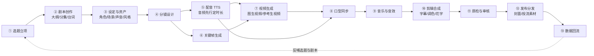

### 2.1 各环节输入、输出与卡点

| # | 环节 | 输入 | 输出 | 主要 AI 能力 | 默认人工卡点 | 自动质检 |
|---|---|---|---|---|---|---|
| ① | 选题立项 | 市场数据、热榜、历史剧数据、（可选）小说原著 | 立项卡：一句话梗概、题材、卖点、目标人群、付费卡点设计 | LLM + 数据分析 | ✅ 立项确认 | 题材合规预审 |
| ② | 剧本创作 | 立项卡 | 设定集（世界观、人物小传、关系图）、分集大纲、分场剧本、台词 | LLM 多 Agent | ✅ 大纲确认；可选分集确认 | 节奏打分、逻辑一致性、合规 |
| ③ | 设定与资产 | 设定集 | 角色定妆照（多角度/多造型）、角色 LoRA/参考集、场景图、声音档案、风格指南 | 文生图、图像编辑、LoRA 训练、音色设计/克隆 | ✅ 定妆与选声确认 | 人脸一致性基线 |
| ④ | 分镜设计 | 分场剧本 + 资产 | 镜头列表（景别、机位、运镜、时长、构图、对白挂载） | LLM（结构化输出） | 可选 | 镜头时长与节奏校验 |
| ⑤ | 配音 | 台词 + 声音档案 + 情绪标注 | 逐句音频、时长、字级时间戳 | TTS、情感控制、ASR 回检 | 可选抽检 | 发音错误（ASR 回转写比对）、响度 |
| ⑥ | 关键帧 | 镜头描述 + 角色/场景参考 | 每镜头 N 张候选首帧（必要时加尾帧） | 文生图 + 身份保持 | 可选（逐镜模式下必选） | 人脸相似度、画面瑕疵、提示词符合度 |
| ⑦ | 视频生成 | 关键帧 + 运动描述 + 时长 | 每镜头 N 个视频候选 | 图生视频、参考生视频、首尾帧 | 可选 | 一致性、瑕疵、运动合理性 |
| ⑧ | 口型同步 | 视频 + 对白音频 | 口型对齐的视频 | Lipsync 模型（或原生音画同步模型） | — | 口型同步分数 |
| ⑨ | 音乐音效 | 情绪曲线、场景标签 | BGM、音效、环境音 | 音乐生成、素材检索、视频生音效 | — | 响度、版权 |
| ⑩ | 剪辑合成 | 选定片段 + 音频 + 字幕 | 时间线（OTIO）、成片、代理预览 | 转场、调色、超分插帧、花字模板 | ✅ 成片审看 | 黑帧、闪烁、音画同步 |
| ⑪ | 质检审核 | 成片 | 质检报告、审核结论 | VLM 评审、内容安全 | ✅ 终审 | 合规、AIGC 标识 |
| ⑫ | 发布分发 | 成片 + 元数据 | 多平台发布、封面、标题、投流素材 | 高光片段剪辑、封面生成、标题生成 | ✅ 发布确认 | 平台规格校验 |
| ⑬ | 数据回流 | 平台数据 | 集完播、追剧率、付费转化、ROI | 归因分析 | — | — |

> **自动化程度配置**：每个项目可以选择卡点模板（全自动 / 关键节点 / 逐镜精修），每个卡点也可以单独设置为“QC 分数达标自动通过”。

---

## 3. 总体架构

### 3.1 分层架构图

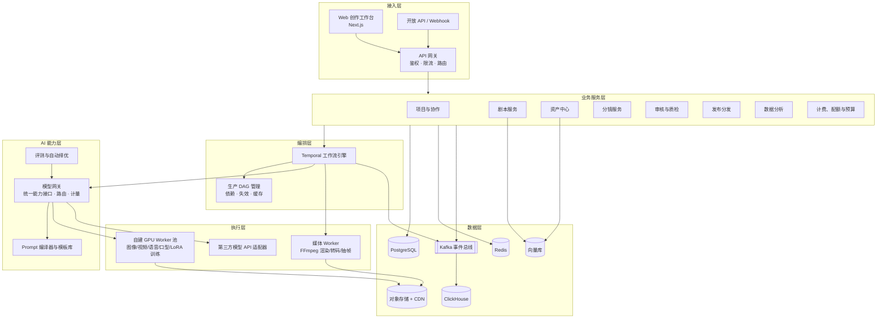

### 3.2 各层职责

| 层 | 职责 | 关键点 |
|---|---|---|
| 接入层 | Web 工作台、开放 API、API 网关 | 统一鉴权（OIDC/JWT）、租户识别、限流；进度通过 SSE/WebSocket 推送 |
| 业务服务层 | 领域逻辑：项目、剧本、资产、分镜、审核、发布、分析、计费 | 初期做**模块化单体**，按领域拆模块，边界清晰后再拆微服务 |
| 编排层 | 长流程编排、人工卡点、重试、增量重算 | Temporal 保证流程状态持久化，可跨天等待人工审核 |
| AI 能力层 | 把“能力”与“模型”解耦 | 业务只调用 `video.i2v`、`audio.tts` 这类能力，由网关选择具体模型 |
| 执行层 | 真正跑模型和媒体处理 | 自建 GPU 与第三方 API 混合；GPU Worker 按模型分池 |
| 数据层 | 业务数据、媒体、向量、分析、事件 | 媒体按内容寻址存储（CAS），天然去重，也方便溯源 |

### 3.3 关键架构决策（ADR 摘要）

完整的决策背景、备选方案和复审条件见 [docs/adr/](adr/README.md)。

| 决策 | 选择 | 理由 | 备选 |
|---|---|---|---|
| 工作流引擎（ADR-0003） | **Temporal** | 流程持续数天、需要等待人工信号、需要可靠重试和版本化；支持多语言 Worker（TS 写流程、Python 跑模型） | Argo Workflows（不擅长人工卡点）、Airflow（面向定时批处理）、Celery（没有持久化的流程状态） |
| 剧本表示（ADR-0002） | **DramaIR（JSON Schema）** | 贯穿全链路的唯一事实来源，可做差异比对和版本管理 | 自由文本 + 正则（不可维护） |
| 时间线格式（ADR-0009） | **OpenTimelineIO（OTIO）** | 行业标准，可导出到 Premiere/DaVinci 做人工精修 | 自定义 JSON |
| 媒体存储（ADR-0005） | **对象存储 + 内容寻址** | 去重、缓存命中、溯源、按生命周期降冷 | 按路径存储 |
| 模型接入（ADR-0004） | **自建模型网关** | 模型快速迭代，需要统一路由、计量、降级 | 业务直连各家 SDK |
| 服务形态（ADR-0007） | **先模块化单体，后拆分** | 团队初期规模小，避免过早引入分布式复杂度 | 一开始就上微服务 |

---

## 4. 核心：剧本中间表示 DramaIR

DramaIR 是整个平台的“骨架”。剧本 Agent 产出它，分镜、配音、画面、剪辑都消费它，前端编辑的也是它。

### 4.1 领域模型层级

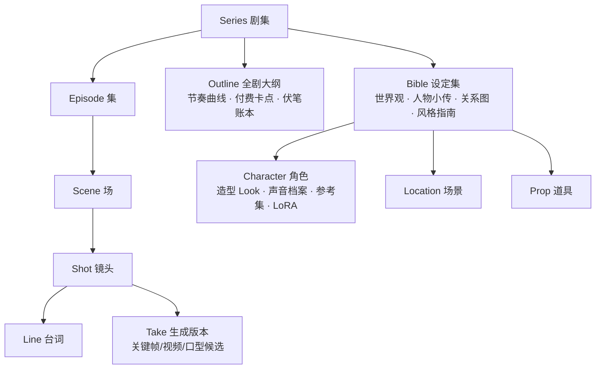

### 4.2 镜头（Shot）示例

```json
{
  "shot_id": "ep03_sc02_sh07",
  "scene_id": "ep03_sc02",
  "order": 7,
  "beat": "reversal",
  "duration": { "hint_s": 4.5, "resolved_s": null },
  "framing": {
    "shot_size": "CU",
    "angle": "eye_level",
    "movement": "push_in",
    "lens_mm": 50,
    "composition": "人物居中偏上，下方预留字幕安全区"
  },
  "location_id": "loc_ceo_office",
  "time_of_day": "night",
  "lighting": "冷色顶光 + 电脑屏幕蓝光",
  "characters": [
    {
      "character_id": "char_linxi",
      "look_id": "look_linxi_office",
      "position": "center",
      "action": "猛地抬头，眼眶泛红",
      "emotion": "委屈转愤怒"
    }
  ],
  "dialogue": [
    {
      "line_id": "l_0231",
      "speaker": "char_linxi",
      "text": "三年了，你连一句解释都不肯给我？",
      "delivery": { "emotion": "angry", "intensity": 0.7, "speed": 1.05 }
    }
  ],
  "sfx": ["文件摔在桌上"],
  "generation_policy": {
    "strategy": "keyframe_i2v_lipsync",
    "tier": "standard",
    "keyframe_candidates": 4,
    "video_candidates": 2
  },
  "locks": []
}
```

要点：

- `duration.resolved_s` 由配音完成后回填（音频先行）。
- `generation_policy` 决定这个镜头走哪条生成路线（见 5.4）。
- `locks` 记录被人工锁定的字段或产物，锁定后上游变更也不会触发重算。
- DramaIR 用 **JSON Schema** 定义，自动生成 TypeScript（zod）和 Python（pydantic）类型，前后端和 Worker 共用一份定义。

### 4.3 版本管理

- 每次保存 DramaIR 都生成一个不可变的**修订版本**（revision），用 JSON Patch 记录差异。
- 生成节点记录它依赖的 revision 和字段路径，因此能精确判断“这次修改影响了哪些镜头”。
- 支持分支：同一集可以保留“A 版结局 / B 版结局”，用于测试。

---

## 5. 子系统详细设计

### 5.1 选题与剧本引擎（Script Studio）

#### 5.1.1 多 Agent 协作

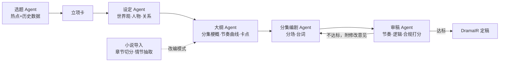

| Agent | 职责 | 关键设计 |
|---|---|---|
| 选题 Agent | 结合平台热榜、历史剧数据和题材库，产出候选立项卡 | 数据来自 5.10 的数据闭环；输出结构化立项卡 |
| 设定 Agent | 世界观、人物小传、人物关系图、角色外貌描述 | 外貌描述同时写入资产中心，作为定妆照的输入 |
| 大纲 Agent | 全剧分集梗概、节奏曲线、付费卡点、伏笔账本 | 内置短剧结构模板（见下） |
| 分集编剧 Agent | 逐集写分场剧本和台词 | 每集只读取“设定集 + 剧情状态 + 前 N 集摘要”，控制上下文长度 |
| 审稿 Agent | 给节奏、爽点密度、逻辑一致性、人设一致性、合规打分 | 不达标就带修改意见打回，最多循环 K 轮后转人工 |

#### 5.1.2 短剧结构模板

- **开篇 3 秒钩子**：第 1 集第一个镜头必须是冲突或悬念。
- **集尾卡点**：每集结尾必须留悬念。
- **爽点密度**：每 30–60 秒一个情绪爆点或反转。
- **付费卡点**：在前几集建立期待后设置付费集（具体集数按平台和题材配置）。
- **题材模板库**：逆袭、重生、甜宠、战神、萌宝、复仇……每种模板定义角色原型、关键情节节点和节奏曲线。

#### 5.1.3 长剧一致性：剧情状态表

80 集的剧不可能一次放进上下文，也很容易前后矛盾。解决办法是维护一份**结构化剧情状态**，每写完一集就更新：

- **人物状态**：身份、处境、谁知道了什么秘密；
- **关系状态**：人物关系的变化；
- **伏笔账本**：已埋下的伏笔（setup）和计划回收的集数（payoff），审稿 Agent 会检查是否遗漏回收；
- **每集摘要**：用于后续集的上下文。

#### 5.1.4 LLM 选型与用法

模型网关对 LLM 同样做能力抽象。以 Claude 为例的建议配置（国内区域见下方说明）：

| 场景 | 建议模型 | 用法要点 |
|---|---|---|
| 大纲、分集剧本、台词 | `claude-opus-5-5` | 开启自适应思考（adaptive thinking），显式设置 effort（Opus 5.5 默认是 `medium`，创作类建议 `high`）；用结构化输出（`output_config.format` + JSON Schema）直接产出 DramaIR |
| 分镜拆解、Prompt 编译、批量改写 | `claude-sonnet-5-5` | 结构化输出；不急的批量任务走 Message Batches（价格约为实时调用的一半） |
| 打标签、分类、合规预筛 | `claude-haiku-4-5` | 低延迟、低成本 |
| 视觉评审（关键帧、视频抽帧） | `claude-opus-5-5` / `claude-sonnet-5-5` | 视频先抽帧，再以图像输入，按评分表（rubric）打分 |

- **Prompt 缓存**：设定集、人物小传、风格指南是每次调用都相同的长前缀，放在 prompt 最前面并开启缓存，能显著降低成本和延迟。
- **异常处理**：网关统一检查 `stop_reason`（如 `refusal`、`max_tokens`），按策略重试或切换模型。
- **国内合规**：在中国境内面向公众提供服务时，需要使用已完成备案的大模型服务。模型网关按**部署区域**路由：国内区域走已备案的国产模型（如通义千问、DeepSeek、豆包等），海外区域可用 Claude。业务代码不感知差异。

#### 5.1.5 剧本知识库（RAG）

- 素材：爆款剧本片段、台词库、题材模板、平台审核规范。
- 存储：向量库（按题材、情节类型、数据表现打标签）。
- 用途：写作时检索“同类情节的高表现写法”作为参考；审稿时检索审核规范。

---

### 5.2 资产中心（角色 / 场景 / 声音 / 风格）

#### 5.2.1 资产类型

| 资产 | 内容 | 用途 |
|---|---|---|
| 角色（Character） | 外貌描述、定妆照（正面/侧面/背面/表情集）、多个造型（Look）、人脸特征向量、LoRA、声音档案 | 关键帧和视频生成的身份参考；质检时的基准 |
| 场景（Location） | 多角度参考图、时间段/光照变体、空间布局描述 | 场景一致性 |
| 道具（Prop） | 参考图、描述 | 关键道具（信物、合同等）的一致性 |
| 声音档案（Voice） | 音色 ID、参考音频、情绪风格、语速 | TTS |
| 风格指南（Style） | 画风（真人写实/国漫/3D/二次元）、LUT、色调、镜头语言偏好、负面提示 | 统一整部剧的视觉风格 |

#### 5.2.2 角色一致性方案（分级）

角色一致性是 AI 短剧的头号难题。平台按成本从低到高提供四级方案，每个项目按画风和预算选择：

| 级别 | 方案 | 适用 |
|---|---|---|
| L1 | **多参考图**：定妆照 + 支持主体参考的图像/视频模型 | 起步方案，成本最低 |
| L2 | **身份保持插件**：在自建图像管线中使用 IP-Adapter / InstantID / PuLID 等 | 真人写实风格 |
| L3 | **角色 LoRA**：用 15–30 张定妆图自动训练角色 LoRA（图像模型和开源视频模型） | 主角、高曝光角色 |
| L4 | **首尾帧控制**：用一致的关键帧锁定首尾帧，再做图生视频 | 关键镜头 |

**一致性校验**（自动质检）：

- 人脸：用 InsightFace（ArcFace）提取人脸特征，与角色基准向量比对，低于阈值自动重生成。
- 服装、发型：VLM 对照角色当前造型的属性清单逐项检查。
- 场景：图像向量相似度 + VLM 检查关键陈设。

#### 5.2.3 定妆流程

1. 设定 Agent 产出外貌描述 → 批量生成定妆候选 → 人工选定。
2. 以选定图为基础生成三视图、表情集、各造型 → 人工确认。
3. 自动训练 LoRA（如启用 L3）→ 用标准测试 prompt 回测一致性 → 入库。
4. 选声：从音色库推荐或声音设计生成若干候选 → 人工确认。若使用真人声音克隆，必须先完成授权（见第 13 节）。

---

### 5.3 分镜引擎（Storyboard）

**输入**：分场剧本 + 资产；**输出**：镜头列表（DramaIR Shot）。

规则与策略：

- **竖屏构图**：9:16，人物主体居中偏上，底部预留字幕和平台 UI 的安全区。
- **镜头语法**：对话用正反打；情绪高点用特写；场景切换先给建立镜头；动作戏拆成短镜头。
- **节奏**：平均镜头 2–4 秒；单镜头不超过视频模型的单次生成上限（通常 5–10 秒），超长镜头自动拆分。
- **对白挂载**：每句台词挂到具体镜头上，决定哪些镜头需要口型同步。
- **生成策略分配**：按镜头类型写入 `generation_policy`（见 5.4.1）。

**Prompt 编译器（Prompt Compiler）**：分镜里的镜头描述是**与模型无关**的结构化数据。编译器把“风格指南 + 角色造型描述 + 场景描述 + 镜头参数”编译成**各个模型各自偏好的 prompt 格式**（不同模型对 prompt 的写法、长度、关键词敏感度差异很大）。编译模板版本化管理，并配有回归评测集。

---

### 5.4 视觉生成（关键帧 → 视频）

#### 5.4.1 按镜头类型选择生成路线

| 镜头类型 | 生成路线 | 说明 |
|---|---|---|
| 对白近景 / 特写 | 关键帧（角色参考）→ 图生视频（小幅动作）→ 口型同步 | 最常见，约占一半以上镜头 |
| 动作 / 多人大场面 | 参考生视频或首尾帧控制，多候选 | 最难，候选数调高 |
| 空镜 / 建立镜头 / 转场 | 文生视频，或静图 + 运镜 | 可大量复用 |
| 道具插入镜头 | 文生图 + 运镜（推拉摇移） | 成本最低 |
| 静态情绪镜头 | 静图 + 2.5D 视差 / 轻微运镜 | **用图片代替视频生成，是重要的降本手段** |
| 原生音画同步 | 支持原生音频生成的视频模型，直接生成带对白的片段 | 模型支持时可省去单独的口型环节，由路由策略决定 |

#### 5.4.2 多候选与自动择优

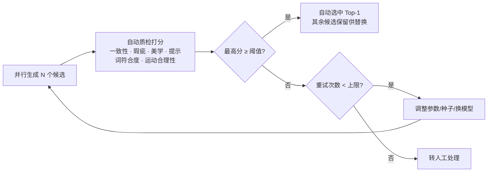

- 综合得分 = Σ(各项得分 × 权重)，权重可按项目调整。
- 人工在“镜头挑选台”可以一键把 Top-1 换成其他候选，这个替换行为会作为偏好数据回流，用来调整评分权重。

#### 5.4.3 后处理

超分（到 1080×1920 或更高）、插帧（到 24/30fps）、统一调色（风格指南中的 LUT）、必要时抠像换背景。

---

### 5.5 配音与口型

#### 5.5.1 音频先行

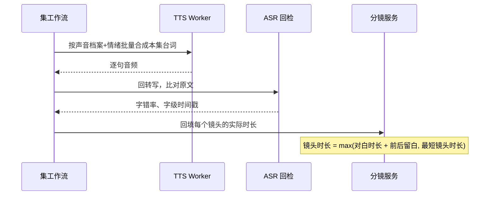

- **情绪控制**：台词的 `delivery` 字段（情绪、强度、语速）映射到 TTS 的情感参数或指令。
- **多角色对话**：每个角色绑定固定音色，保证全剧一致。
- **发音纠错**：多音字、人名、专有名词维护词典；ASR 回转写字错率超过阈值则自动重合成。

#### 5.5.2 口型同步

- **路线 A（默认）**：先生成视频，再用口型模型按对白音频驱动嘴部。
- **路线 B**：模型支持原生音画同步时，直接生成带对白的片段，再用 ASR 校验台词正确性。
- 质检：用 SyncNet 类指标（LSE-C / LSE-D）评估口型同步，不达标则换候选或重做。

---

### 5.6 音乐与音效

| 类别 | 方案 |
|---|---|
| BGM | 按情绪曲线分段：先从已授权曲库检索，不满足时用 AI 音乐生成；每部剧建立主题音乐（Theme）复用 |
| 音效（SFX） | 按分镜中的 `sfx` 标签从音效库检索；缺失时用文本生成音效或视频生成音效（video-to-audio）模型 |
| 环境音 | 按场景（办公室、街道、雨夜）从环境音库铺底 |
| 混音 | 对白出现时 BGM 自动压低（ducking）；整体响度标准化（短视频平台常用约 -14 LUFS，按平台规格配置）；限制峰值 |

---

### 5.7 剪辑合成与渲染

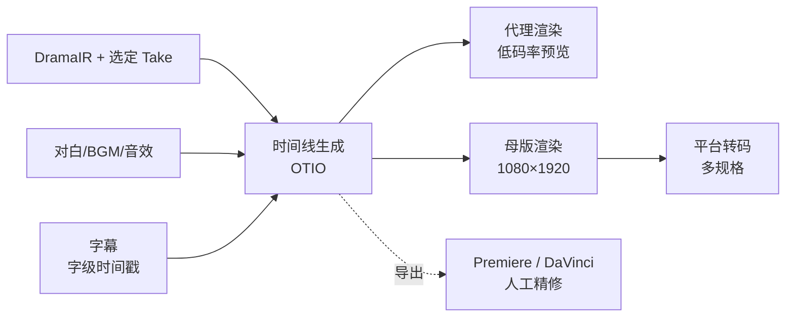

- **时间线生成**：视频轨（镜头、转场）、音频轨（对白、BGM、音效、环境音）、字幕轨、贴片层（花字、特效贴纸）、标识层（AIGC 标识、水印、Logo）。
- **字幕**：用 ASR 字级时间戳对齐；支持短剧常见的字幕样式模板、花字高亮关键词。
- **渲染**：FFmpeg（filter graph）+ GPU 硬件编码；按镜头分段并行渲染后再拼接。
- **代理预览**：每次修改先出低码率代理文件（HLS），前端秒级预览，确认后再渲染母版。
- **人工精修出口**：导出 OTIO / FCPXML，可在专业剪辑软件中精修后回传。

---

### 5.8 质检（QC）与审核

#### 5.8.1 自动质检项

| 维度 | 检查项 | 实现 |
|---|---|---|
| 技术规格 | 分辨率、帧率、码率、黑帧、冻帧、闪烁、花屏 | FFmpeg 滤镜 + 规则 |
| 画面质量 | 手部/面部畸变、穿模、文字乱码、美学分 | VLM 评审 + 美学评分模型 |
| 一致性 | 人脸相似度、服装发型、场景 | ArcFace、VLM、图像向量 |
| 叙事符合度 | 画面是否符合镜头描述 | VLM 对照镜头描述逐项打分 |
| 音频 | 响度、削波、静音段、TTS 字错率 | 响度分析、ASR 回转写 |
| 口型 | 音画同步分数 | SyncNet 类指标 |
| 字幕 | 对齐误差、错别字、敏感词 | 对齐算法 + 文本审核 |
| 内容安全 | 暴力血腥、低俗、未成年人、价值导向、敏感人物 | 第三方内容安全服务 + 自建规则 + VLM |
| 权利 | 名人肖像识别、商标、未授权音乐 | 人脸库比对、音频指纹 |
| 标识 | AIGC 显式标识是否存在、隐式标识是否写入 | 规则校验 |

#### 5.8.2 人工审核

- **审核台**：按集审看；支持**帧级批注**（带时间码的评论）；打回时选择原因分类（一致性、瑕疵、节奏、合规……）。
- **打回原因回流**：原因分类作为标注数据，用于优化自动质检阈值和生成策略。
- **分级审核**：普通问题由制片审核；合规问题必须由有资质的审核员终审。

---

### 5.9 发布分发与投放素材

| 模块 | 设计 |
|---|---|
| 平台适配器 | 每个平台一个适配器：规格校验、转码配置、元数据映射、上传、状态回查。有开放接口的走接口直发；没有的生成**标准交付包**（成片、封面、简介、分集信息、备案信息）供人工上传 |
| 目标平台 | 国内：抖音、快手、视频号、短剧 App 等；出海：TikTok、YouTube Shorts、海外短剧 App |
| 封面与标题 | 从高光镜头生成多版封面和标题，做 A/B 测试 |
| 投流素材 | 自动截取高光片段（冲突、反转、卡点），混剪成多条投放素材，批量产出多版本 |
| 多语言出海 | 翻译台词 → 目标语言配音（保留原角色音色）→ 重做口型 → 多语言字幕；文化适配由 LLM 预审 |
| 排期 | 按平台的更新节奏排期发布 |

---

### 5.10 数据回流与增长

- **采集**：平台开放数据接口 + 投放平台报表 → Kafka → ClickHouse。
- **核心指标**：前 3 秒留存、单集完播率、追剧率（下一集点击率）、付费集转化率、充值 ARPU、投放 ROI。
- **归因**：把指标关联到剧本特征（题材、钩子类型、反转密度、付费卡点位置）、角色、封面和投流素材版本。
- **反哺**：
  - 选题 Agent 读取题材表现排行；
  - 剧本知识库优先收录高表现片段；
  - 封面和投流素材的 A/B 结果用于调整生成策略；
  - 前几集的数据可以指导后续集的剧情调整（边播边改）。

---

## 6. 工作流编排与增量重算

### 6.1 工作流层级

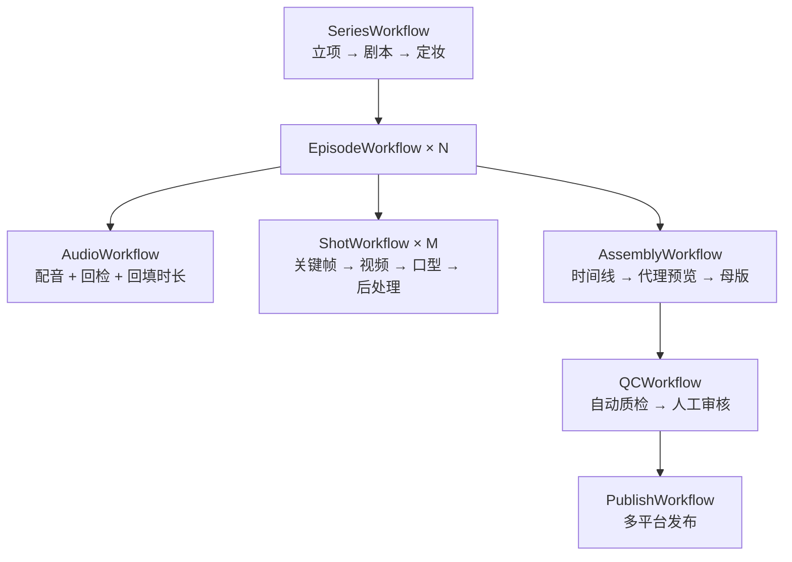

- 流程定义用 TypeScript（与业务类型共享），模型推理和媒体处理作为 Python Activity 运行在各自的 Task Queue 上。
- **人工卡点**用 Temporal Signal 实现：流程挂起等待审核结果，期间可以设置定时提醒和超时升级。
- **并发控制**：每集的镜头工作流并行，但受项目级和租户级并发配额限制。

### 6.2 生成节点状态机

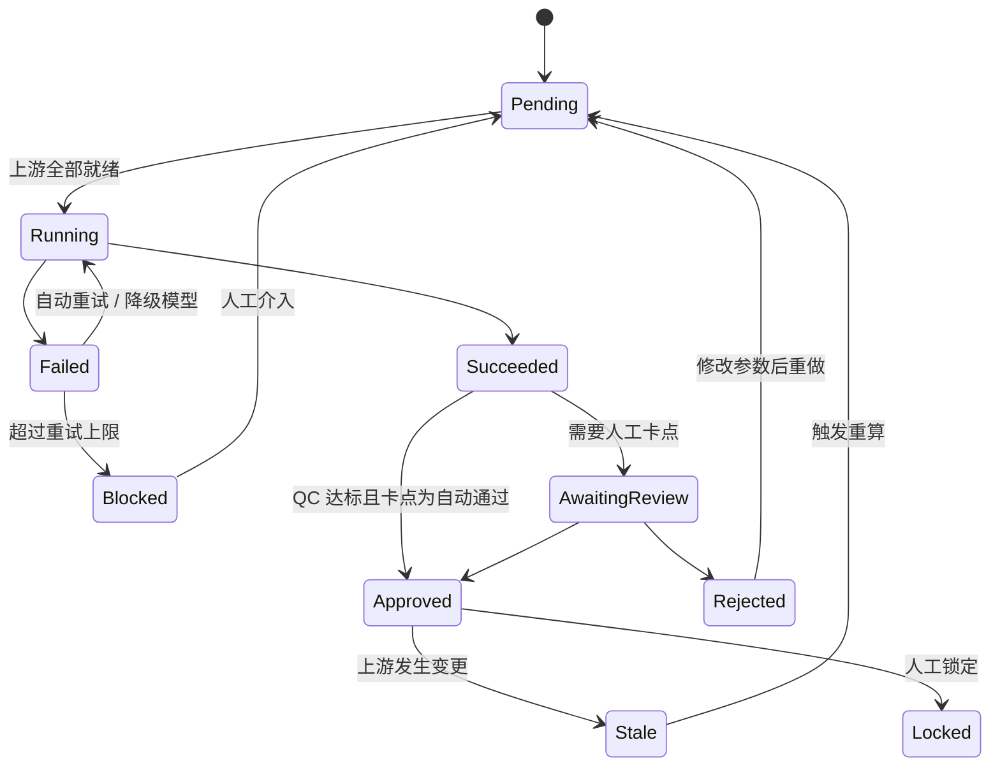

### 6.3 增量重算（像构建系统一样）

每个生成节点的**缓存键**：

```
node_key = hash(节点类型, 能力/模型版本, 参数, prompt 模板版本, 上游产物哈希列表, DramaIR 相关字段哈希)
```

- 键相同 → 直接复用已有产物（命中缓存，零成本）。
- 上游变化 → 下游节点标记为 `Stale`，只重算这一部分。
- `Locked` 节点不会被上游变化影响（人工确认过的镜头不会被意外覆盖）。

示例：修改一句台词后的影响范围。

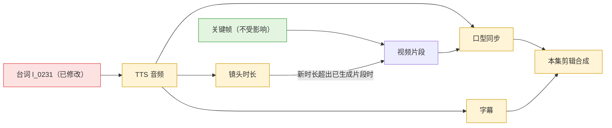

> 如果新时长仍在已生成片段的长度范围内，视频片段只需要重新裁剪，不需要重新生成。

### 6.4 失败处理

| 失败类型 | 处理 |
|---|---|
| 供应商超时 / 限流 / 5xx | 指数退避重试；熔断后切换到同能力的备用模型 |
| 内容被模型拒绝 | 自动改写 prompt 重试一次；仍失败则转人工 |
| QC 不达标 | 换种子 / 调参 / 升一档模型，达到上限后转人工 |
| Worker 崩溃 | Temporal 心跳超时后在其他 Worker 上重跑（Activity 必须幂等） |
| 预算超限 | 暂停流程并通知负责人，可选择降级继续 |

---

## 7. 模型网关（AI Gateway）

### 7.1 统一能力接口

| 能力域 | 能力 |
|---|---|
| 文本 | `text.generate`、`text.structured`（按 Schema 输出） |
| 图像 | `image.t2i`、`image.i2i`、`image.ref`（身份/主体参考）、`image.inpaint`、`image.upscale` |
| 视频 | `video.t2v`、`video.i2v`、`video.flf2v`（首尾帧）、`video.ref2v`、`video.v2v`、`video.extend`、`video.upscale`、`video.interpolate` |
| 音频 | `audio.tts`、`audio.voice_clone`、`audio.music`、`audio.sfx`、`audio.asr`、`audio.align` |
| 口型 | `video.lipsync` |
| 视觉理解 | `vision.judge`（评分）、`vision.caption` |
| 训练 | `train.lora` |
| 审核 | `moderation.text`、`moderation.image`、`moderation.audio`、`moderation.video` |

### 7.2 请求示例

```json
POST /v1/invoke
{
  "capability": "video.i2v",
  "tier": "standard",
  "inputs": {
    "image": "cas://sha256/9f2c…",
    "prompt_ref": "compiled://ep03_sc02_sh07/video/v3",
    "duration_s": 5,
    "aspect_ratio": "9:16"
  },
  "constraints": { "max_cost": 3.0, "deadline_s": 900, "region": "cn" },
  "idempotency_key": "node:ep03_sc02_sh07:video:9a1e…",
  "trace": { "tenant": "t_01", "project": "p_88", "node": "n_5521" }
}
```

### 7.3 核心能力

- **适配器**：每个模型一个适配器，屏蔽同步/异步差异。异步模型统一为“提交 → 回调或轮询 → 完成”，完成后通过 Temporal 的异步 Activity 完成机制唤醒流程。
- **路由策略**：按能力匹配（时长、分辨率、是否支持参考图）→ 档位（草稿/标准/精品）→ 区域合规 → 成本 → 实时成功率与延迟 → A/B 实验分流。
- **限流与配额**：按供应商账号做令牌桶和并发上限；按租户和项目做配额。
- **计量**：每次调用记录成本到账本（租户 / 项目 / 集 / 镜头 / 节点），支撑成本看板和计费。
- **熔断与降级**：供应商错误率超过阈值时熔断，切换到备用模型或降一档。
- **Prompt 与模型版本管理**：Prompt 模板和模型版本都纳入缓存键；上线新模型前在**评测集**上跑回归（一致性、瑕疵率、成本、时延），通过后再灰度放量。

### 7.4 候选模型清单（示例，上线前需以评测结果为准）

| 能力 | 第三方 API（示例） | 可自建的开源模型（示例） |
|---|---|---|
| LLM | Claude（海外区域）；通义千问、DeepSeek、豆包（国内区域） | Qwen、DeepSeek 开源权重 |
| 文生图 / 图像编辑 | 即梦 / Seedream、通义万相、可灵图像等 | FLUX 系列、Qwen-Image、HunyuanImage；配合 ControlNet、IP-Adapter、PuLID、InstantID |
| 视频生成 | 可灵、即梦 / Seedance、海螺、Vidu、Veo、Runway 等 | Wan 系列、HunyuanVideo、LTX-Video |
| TTS / 声音克隆 | MiniMax 语音、豆包语音、ElevenLabs 等 | CosyVoice、IndexTTS、Fish Speech |
| 口型同步 | 商用口型 API | LatentSync、MuseTalk |
| 音乐 | Suno、MiniMax 音乐等 | ACE-Step、YuE |
| 音效 | 音效库 | MMAudio、HunyuanVideo-Foley |
| ASR / 对齐 | 云厂商 ASR | FunASR（Paraformer）、SenseVoice、Whisper |
| 超分 / 插帧 | — | Real-ESRGAN、RIFE |
| 人脸特征 | — | InsightFace（ArcFace） |
| 内容安全 | 云厂商内容安全服务 | 自建规则 + VLM 辅助 |

> 策略建议：**早期以第三方 API 为主**，快速验证全链路；量起来后，把调用量大、效果差距小的能力（关键帧、TTS、口型、超分）逐步迁到自建开源模型上降本；视频生成则长期保持“第三方 + 自建”混合。

---

## 8. GPU 推理集群与任务调度

### 8.1 架构

- **Kubernetes + NVIDIA GPU Operator**，GPU 节点按显存规格分池。
- **Worker 即 Temporal Activity Worker**：每类模型一个 Task Queue（如 `gpu-video-wan`、`gpu-image-flux`、`gpu-tts`），Worker 拉取任务执行。Temporal 同时承担队列、重试和超时管理，不再另建任务队列。
- **弹性伸缩**：用 KEDA 按 Task Queue 积压量伸缩 Worker；批量任务可使用竞价/抢占式实例。
- **模型权重**：放在共享高速存储上（如 JuiceFS + 节点本地 NVMe 缓存），缩短冷启动。
- **图像管线**：自建图像流程可以用无界面 ComfyUI 作为执行引擎，工作流 JSON 作为模板纳入版本管理，便于算法同学快速迭代。
- **多卡推理**：大视频模型用序列并行等多卡并行推理框架（如 xDiT）降低单任务时延。

### 8.2 优先级与隔离

| 队列 | 场景 | 策略 |
|---|---|---|
| 交互队列（interactive） | 用户在工作台点“重新生成”，期望分钟级返回 | 预留容量，不使用竞价实例 |
| 批量队列（batch） | 整集、整部剧的批量生成 | 充分利用空闲算力，可在夜间集中执行 |
| 训练队列（training） | 角色 LoRA 训练 | 独立节点池，避免挤占推理 |

### 8.3 容量估算公式

```
所需 GPU 数 ≈ 月生成量(视频秒数) × 单位秒数的推理耗时(GPU·秒) ÷ (每月可用 GPU·秒 × 目标利用率)
```

单位耗时取决于模型、分辨率和步数，需要在 PoC 阶段实测后代入。

---

## 9. 数据架构

### 9.1 存储选型

| 存储 | 用途 | 选型 |
|---|---|---|
| 关系库 | 业务主数据、DramaIR（JSONB）、节点状态、审核、账本 | PostgreSQL（开启行级安全做多租户隔离） |
| 缓存 | 会话、限流、热点数据、进度发布订阅 | Redis |
| 对象存储 | 所有媒体文件（内容寻址） | S3 兼容（阿里云 OSS / 腾讯云 COS / AWS S3 / 私有化 MinIO）+ CDN |
| 向量库 | 剧本片段检索、角色/场景图像特征、素材检索 | 初期 pgvector，规模上来后迁 Milvus |
| 分析库 | 播放数据、调用日志、成本分析 | ClickHouse |
| 事件总线 | 领域事件、进度通知、数据同步 | Kafka（或 Redpanda） |
| 工作流状态 | 流程持久化 | Temporal（后端存储用 PostgreSQL 或 Cassandra） |

### 9.2 核心表（摘要）

```sql
-- 镜头：DramaIR 的镜头节点物化，便于查询和并发编辑
CREATE TABLE shot (
  id              TEXT PRIMARY KEY,           -- ep03_sc02_sh07
  tenant_id       UUID NOT NULL,
  episode_id      TEXT NOT NULL,
  scene_id        TEXT NOT NULL,
  seq             INT  NOT NULL,
  spec            JSONB NOT NULL,             -- DramaIR Shot
  ir_revision     BIGINT NOT NULL,            -- 来源 DramaIR 修订版本
  selected_take   UUID,                       -- 当前选中的生成版本
  status          TEXT NOT NULL,
  locked          BOOLEAN NOT NULL DEFAULT FALSE,
  updated_at      TIMESTAMPTZ NOT NULL DEFAULT now()
);

-- 生成节点：生产 DAG 中的一个节点
CREATE TABLE gen_node (
  id              UUID PRIMARY KEY,
  tenant_id       UUID NOT NULL,
  project_id      UUID NOT NULL,
  owner_type      TEXT NOT NULL,              -- shot / line / episode / character
  owner_id        TEXT NOT NULL,
  kind            TEXT NOT NULL,              -- keyframe / video / tts / lipsync / render ...
  node_key        TEXT NOT NULL,              -- 缓存键（见 6.3）
  params          JSONB NOT NULL,
  upstream_ids    UUID[] NOT NULL DEFAULT '{}',
  state           TEXT NOT NULL,              -- Pending / Running / ... / Locked
  attempts        INT NOT NULL DEFAULT 0,
  cost_total      NUMERIC(12,4) NOT NULL DEFAULT 0,
  workflow_run_id TEXT,
  created_at      TIMESTAMPTZ NOT NULL DEFAULT now()
);
CREATE INDEX ON gen_node (node_key);

-- 媒体资产：内容寻址
CREATE TABLE asset (
  sha256          TEXT PRIMARY KEY,
  media_type      TEXT NOT NULL,              -- image/png, video/mp4, audio/wav ...
  bytes           BIGINT NOT NULL,
  meta            JSONB NOT NULL,             -- 分辨率、时长、帧率、编码 ...
  storage_uri     TEXT NOT NULL,
  created_at      TIMESTAMPTZ NOT NULL DEFAULT now()
);

-- 生成结果：节点的一次产出（候选）
CREATE TABLE take (
  id              UUID PRIMARY KEY,
  node_id         UUID NOT NULL REFERENCES gen_node(id),
  asset_sha256    TEXT NOT NULL REFERENCES asset(sha256),
  model           TEXT NOT NULL,              -- provider/model@version
  seed            BIGINT,
  qc_scores       JSONB,                      -- 各项质检得分
  score           REAL,
  chosen          BOOLEAN NOT NULL DEFAULT FALSE,
  cost            NUMERIC(12,4) NOT NULL DEFAULT 0,
  created_at      TIMESTAMPTZ NOT NULL DEFAULT now()
);

-- 成本账本
CREATE TABLE cost_ledger (
  id              BIGSERIAL PRIMARY KEY,
  tenant_id       UUID NOT NULL,
  project_id      UUID NOT NULL,
  episode_id      TEXT,
  node_id         UUID,
  provider        TEXT NOT NULL,
  capability      TEXT NOT NULL,
  units           NUMERIC(14,4) NOT NULL,     -- tokens / 秒 / 张 / 字
  unit_type       TEXT NOT NULL,
  amount          NUMERIC(12,4) NOT NULL,
  created_at      TIMESTAMPTZ NOT NULL DEFAULT now()
);
```

其他主要表：`tenant`、`user`、`project`、`episode`、`scene`、`line`、`character`、`character_look`、`voice_profile`、`location`、`prop`、`style_guide`、`ir_revision`、`review`、`comment`、`publish_target`、`publication`、`prompt_template`、`model_endpoint`、`consent_record`（授权记录）。

### 9.3 对象存储规范

```
cas/sha256/ab/cd/abcdef…            # 内容寻址原文件（不可变）
proxy/{project}/{episode}/…          # 代理预览（可重建，短生命周期）
master/{project}/{episode}/…         # 成片母版（长期保存，跨区域复制）
delivery/{project}/{platform}/…      # 平台交付包
```

- **生命周期**：未选中的候选 30 天后转低频存储，90 天后删除（可配置）；母版长期保存。
- **访问**：一律通过短时效预签名 URL 访问；未发布内容的预览叠加带用户 ID 的水印，便于追溯泄露。

### 9.4 资产血缘

每个 Take 都记录：来源节点 → 模型版本 → prompt 版本 → 输入资产。任意一帧都能追溯“它是怎么生成出来的”。这既用于问题排查，也是 AIGC 隐式标识和合规审计的基础。

---

## 10. 前端创作工作台

| 模块 | 功能 | 技术要点 |
|---|---|---|
| 项目看板 | 剧集列表、每集进度（按环节）、异常汇总、成本概览 | 进度通过 SSE 实时推送 |
| 剧本编辑器 | 结构化剧本编辑（集/场/台词）、AI 改写、多人协同、版本对比 | TipTap + Yjs 协同；编辑结果写回 DramaIR |
| 设定与资产库 | 角色卡、造型、定妆照、声音试听、场景库 | 大图懒加载、对比视图 |
| 分镜板 | 镜头网格、拖拽排序、镜头参数编辑、关键帧预览 | 虚拟滚动（单集上百个镜头） |
| 镜头挑选台 | 同一镜头的多个候选并排对比，一键替换、锁定、重生成 | 候选按 QC 得分排序 |
| 时间线剪辑器 | 轻量剪辑：修剪、替换、调整字幕、音量 | 基于代理文件和 WebCodecs 预览 |
| 审核台 | 成片审看、帧级批注、打回原因、审核记录 | 带时间码的评论 |
| 节点编辑器（高级） | 自定义生产流水线（类似“整部剧级别的 ComfyUI”） | React Flow；节点类型由后端注册 |
| 数据看板 | 成本、产能、质量指标、播放与付费数据 | 图表 + 下钻 |

---

## 11. 接口设计

### 11.1 对外 REST API（示例）

```
POST   /api/v1/projects                                创建剧集项目
POST   /api/v1/projects/{id}/script:generate           生成剧本（异步，返回 run_id）
GET    /api/v1/projects/{id}/bible                     获取设定集
PATCH  /api/v1/episodes/{id}/ir                        提交 DramaIR 修改（JSON Patch）
GET    /api/v1/episodes/{id}/shots                     镜头列表
POST   /api/v1/shots/{id}:regenerate                   重生成 {"stage":"video","tier":"premium","candidates":3}
POST   /api/v1/shots/{id}/takes/{take_id}:select       选择候选
POST   /api/v1/nodes/{id}:approve | :reject | :lock    审核与锁定
POST   /api/v1/episodes/{id}:render                    渲染成片
POST   /api/v1/episodes/{id}:publish                   发布 {"targets":["douyin","kuaishou"]}
GET    /api/v1/runs/{id}/events                        运行进度（SSE）
GET    /api/v1/projects/{id}/costs                     成本明细
```

### 11.2 领域事件（Kafka Topic 示例）

| 事件 | 生产者 | 消费者 |
|---|---|---|
| `ir.revised` | 剧本服务 | DAG 管理（计算失效范围） |
| `node.state_changed` | 编排层 | 通知服务、前端推送、分析 |
| `review.requested` / `review.completed` | 审核服务 | 通知、编排层 |
| `cost.recorded` | 模型网关 | 计费、预算告警 |
| `publication.status_changed` | 发布服务 | 数据分析 |
| `metrics.ingested` | 数据采集 | 分析、选题 Agent |

### 11.3 扩展机制：节点插件

每个生产步骤是一个**节点类型**，声明输入/输出类型、参数 Schema、所需能力和缓存键规则。接入新模型或新步骤时只需注册一个新节点类型，无需修改编排核心。开放 API 也允许外部系统以 Webhook 方式提供节点（例如外包的人工精修环节）。

---

## 12. 非功能设计

### 12.1 性能与容量

- 编排层与业务服务无状态，水平扩展；瓶颈在 GPU 和第三方配额，由网关统一调度。
- 前端预览全部基于代理文件和 CDN，避免直接拉取母版。
- 批量任务尽量安排在夜间和低峰期，平滑 GPU 负载。

### 12.2 可靠性

- Temporal 保证流程不丢；所有 Activity 以 `idempotency_key` 保证幂等。
- 第三方供应商至少准备两家可互相替代，由网关自动切换。
- PostgreSQL 开启时间点恢复（PITR）；母版对象跨区域复制。
- 回调接口做签名校验和去重。

### 12.3 可观测性

- **链路追踪**：OpenTelemetry 贯穿 API → 工作流 → Activity → 模型供应商，按镜头即可查看完整链路。
- **指标**（Prometheus + Grafana）：队列积压、GPU 利用率、各供应商成功率/延迟/单价、各环节 QC 通过率、出片进度。
- **日志**：Loki 或 ELK，按租户、项目、节点检索。
- **告警**：供应商熔断、队列积压超阈值、预算接近上限、QC 通过率骤降。

### 12.4 安全与多租户

- 租户隔离：PostgreSQL 行级安全 + 对象存储按租户前缀隔离 + 独立的配额。
- 密钥管理：供应商 API Key 存放在 Vault 或云 KMS 中，按区域和环境隔离。
- 权限模型：RBAC（编剧、导演、美术、剪辑、审核、运营、管理员），按项目授权。
- 审计：关键操作（审核结论、发布、授权变更、资产删除）全部留审计日志。
- 防泄露：未发布内容预览叠加可追溯水印；下载需审批。

### 12.5 成本控制

- **预算层级**：租户 → 项目 → 集 → 节点，超过 80% 告警，超过 100% 暂停或自动降级。
- **降本手段**（按效果排序）：
  1. 关键帧先行：在便宜的图像阶段拦下不合格结果，减少视频的无效生成；
  2. 先草后精：预览版用低成本模型，确认后再精修；
  3. 静态镜头用“图片 + 运镜”代替视频生成；
  4. 缓存复用：相同输入直接命中；空镜、转场跨集复用；
  5. 自动 QC 精准择优，降低候选倍数；
  6. 量大的能力迁到自建开源模型；非实时的 LLM 任务走批处理接口；
  7. GPU 批量任务使用竞价实例和夜间低价时段。

---

## 13. 合规设计

> 以下为架构层面的合规要求梳理，具体执行需以最新法规和法务意见为准。

### 13.1 中国境内

| 要求 | 依据（示例） | 平台实现 |
|---|---|---|
| AIGC 内容标识 | 《人工智能生成合成内容标识办法》（2025 年 9 月 1 日起施行）及配套强制性国家标准 GB 45438-2025 | 渲染时强制叠加**显式标识**（如画面角标/片头提示）；在文件元数据中写入**隐式标识**；标识状态纳入 QC 必检项 |
| 生成式 AI 服务 | 《生成式人工智能服务管理暂行办法》《互联网信息服务深度合成管理规定》 | 国内区域只路由到已备案的模型服务；保留生成日志；提供投诉举报通道 |
| 微短剧备案审核 | 广电总局关于网络微短剧分类分层审核备案的管理要求 | 项目元数据中记录备案信息；发布前校验备案状态；导出送审材料包 |
| 内容安全 | 网络内容生态治理相关规定 | 剧本、画面、音频、字幕多层审核；审核记录留存 |
| 肖像权、声音权 | 《民法典》人格权编（对自然人声音的保护参照肖像权） | 使用真人形象或声音克隆前必须签署授权，授权记录（`consent_record`）与资产绑定，到期或撤回时自动冻结相关资产 |
| 个人信息 | 《个人信息保护法》（人脸、声纹属于敏感个人信息） | 单独同意、最小必要、加密存储、可删除 |
| 版权 | 《著作权法》 | 小说改编需有授权记录；音乐只使用授权曲库或可商用的生成结果；音频指纹比对 |

### 13.2 出海

- **欧盟**：《人工智能法》（EU AI Act）对深度合成内容有透明度义务，需要显著标注 AI 生成。
- **内容凭证**：支持写入 C2PA 内容凭证。
- **数据驻留**：海外用户数据和素材存放在海外区域，不跨境回传。

---

## 14. 技术栈选型汇总

| 领域 | 选型 |
|---|---|
| 前端 | Next.js + React + TypeScript；TanStack Query、Zustand；TipTap + Yjs（协同编辑）；React Flow（节点编辑器）；WebCodecs（预览） |
| API / BFF | TypeScript（NestJS），与前端共享 DramaIR 类型 |
| 工作流 | Temporal（流程定义用 TypeScript SDK，Activity 用 Python SDK） |
| AI / 媒体 Worker | Python；PyTorch、diffusers、ComfyUI（无界面模式）、FFmpeg、OpenTimelineIO |
| 模型网关 | 独立服务（Go 或 TypeScript），适配器插件化 |
| 数据 | PostgreSQL（+ pgvector）、Redis、ClickHouse、Kafka、S3 兼容对象存储、CDN |
| 基础设施 | Kubernetes、NVIDIA GPU Operator、KEDA、Helm、Terraform、Argo CD |
| 可观测性 | OpenTelemetry、Prometheus、Grafana、Loki |
| 安全 | Keycloak（或云 IAM）、Vault / 云 KMS |
| Schema | JSON Schema 作为唯一来源 → 生成 zod（TS）/ pydantic（Python） |

---

## 15. 代码仓库结构

采用 monorepo。顶层目录由 `tools/archcheck` 在 CI 中校验（INV-11），新增顶层目录需要先写 ADR 并更新本节。

```
dramio/
├── apps/
│   ├── web/                    # Next.js 创作工作台
│   └── api/                    # NestJS API / BFF
├── services/
│   ├── orchestrator/           # Temporal 工作流定义（TS）
│   ├── model-gateway/          # 模型网关与供应商适配器
│   ├── publisher/              # 平台发布适配器
│   └── analytics/              # 数据采集与归因
├── workers/                    # Python Activity Workers
│   ├── llm/                    # 剧本、分镜、审稿 Agent
│   ├── image/                  # 关键帧、定妆、LoRA 训练
│   ├── video/                  # 视频生成、超分、插帧
│   ├── audio/                  # TTS、ASR、音乐、音效、混音
│   ├── lipsync/
│   ├── render/                 # 时间线、FFmpeg 渲染、转码
│   └── qc/                     # 自动质检
├── packages/
│   ├── drama-ir/               # DramaIR JSON Schema + 生成的 TS/Python 类型
│   ├── prompts/                # 版本化 Prompt 模板与编译器
│   ├── node-sdk/               # 节点插件 SDK
│   └── ui/                     # 共享 UI 组件
├── evals/                      # 各能力的评测集与回归脚本
├── spikes/                     # P0 一次性验证代码（不可被产品代码依赖）
├── infra/
│   ├── helm/
│   ├── terraform/
│   └── docker/
├── tools/
│   └── archcheck/              # 架构自动检查（适应度函数）
├── docs/
│   ├── architecture.md         # 本文档
│   ├── governance.md           # 架构治理与落地保障
│   ├── adr/                    # 架构决策记录
│   └── tech-debt.md            # 技术债与豁免登记
├── CLAUDE.md                   # AI 编码助手的项目约束
└── REVIEW.md                   # 代码评审规则
```

---

## 16. 部署架构

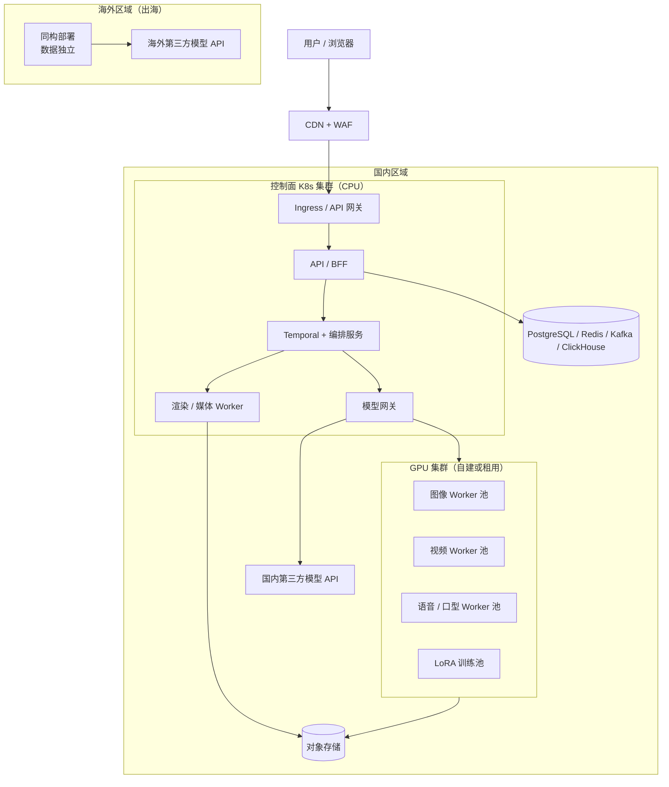

- 环境：`dev` / `staging` / `prod`，GPU 在 staging 与 prod 间可以共享批量队列。
- 发布：GitOps（Argo CD）；工作流代码变更使用 Temporal 的版本化机制，保证正在运行的流程不受影响。
- 私有化部署：同一套 Helm Chart，替换对象存储为 MinIO、模型全部走自建，可交付给对数据有要求的客户。

---

## 17. 演进路线

| 阶段 | 周期 | 目标 | 关键交付 |
|---|---|---|---|
| **P0 技术验证** | 2–4 周 | 证明全链路可行 | 命令行脚本串起：剧本 → 分镜 → 配音 → 关键帧 → 视频 → 口型 → 剪辑，全自动产出 1 集 1 分钟成片；各环节候选模型的效果与成本评测 |
| **P1 MVP** | 2–3 月 | 小团队可用的内部生产工具 | DramaIR v1；剧本 Agent；资产中心（L1 一致性）；Temporal 编排 + 人工卡点；模型网关（第三方 API 为主）；分镜板、镜头挑选台、审核台；成片导出；成本记录 |
| **P2 规模化生产** | 3–6 月 | 质量稳定、成本可控，支持多部剧并行 | 角色 LoRA 自动训练（L2/L3）；自动 QC 与自动择优；增量重算；时间线剪辑器；自建 GPU 集群并迁移部分能力；预算与降级；OTIO 导出 |
| **P3 闭环与平台化** | 6–12 月 | 从工具变成平台 | 多平台分发与投流素材；数据回流与选题反哺；多语言出海；节点插件与开放 API；多租户 SaaS；私有化部署 |

**P0 阶段优先验证的问题**：

1. 角色一致性在 30+ 个镜头内能否稳定达标？
2. 单集 AI 成本和人工工时分别是多少？
3. 对白镜头的口型效果是否达到可播出水平？
4. 哪个环节的人工返工最多？（决定 P1 的投入重点）

各阶段的**退出标准**、**允许的简化**以及 P1 从“行走骨架”起步的做法，见 [governance.md §7](governance.md#7-分阶段落地)。

---

## 18. 风险与对策

| 风险 | 影响 | 对策 |
|---|---|---|
| 模型能力快速迭代，今天的最优选择下个月就过时 | 技术投入白费 | 模型网关 + 能力抽象 + 评测集，新模型上线只需接适配器并跑回归 |
| 角色一致性不达标 | 观感差、返工多 | 四级一致性方案 + 自动人脸校验 + 关键镜头人工锁定 |
| 成本失控（候选过多、反复重做） | 单集成本过高 | 关键帧先行、先草后精、预算硬上限、成本看板 |
| 供应商限流、涨价或下线 | 产线停摆 | 每种能力至少两家可替代；逐步自建核心能力 |
| 合规风险（未标识、未备案、侵权） | 下架、处罚 | 合规内建为强制步骤；授权记录与资产绑定；终审必须由合规审核员完成 |
| 生成质量不稳定导致人工返工 | 产能上不去 | 自动 QC 前置；打回原因数据化，持续优化生成策略 |
| GPU 资源紧张 | 交付延期 | 自建与租用混合；交互与批量队列隔离；夜间批处理 |
| 长剧剧情前后矛盾 | 剧本质量差 | 剧情状态表 + 伏笔账本 + 审稿 Agent 一致性检查 |

---

## 19. 附录：成本模型与术语

### 19.1 单集成本模型

```
单集成本 = LLM 成本（剧本 + 分镜 + 审稿 + 视觉评审，按 tokens）
         + 关键帧成本（镜头数 × 关键帧候选数 × 单张价格）
         + 视频成本（Σ 镜头时长 × 视频候选倍数 × 每秒价格）
         + 配音成本（字数 × 单价，含重合成）
         + 口型成本（对白镜头秒数 × 单价）
         + 音乐音效成本
         + 渲染与存储成本（CPU/GPU 时长、存储、CDN）
         + 人工成本（审核、精修工时 × 时薪）
```

- 通常**视频生成是 AI 成本的最大头**，其中“视频候选倍数”是最敏感的变量。把平均候选倍数从 3 降到 1.5，视频成本直接减半，这正是自动 QC 和关键帧先行的价值所在。
- 平台在每个项目的成本看板上按上述公式拆解，并与预算对比。

### 19.2 术语表

| 术语 | 含义 |
|---|---|
| DramaIR | 平台内部的结构化剧本表示（剧 → 集 → 场 → 镜 → 台词） |
| Bible（设定集） | 世界观、人物小传、关系图、风格指南的集合 |
| Look（造型） | 角色的一套固定外观（服装、发型、妆容） |
| Take | 一个生成节点的一次产出（候选） |
| 关键帧先行 | 先生成并筛选静态首帧，再进行图生视频 |
| 音频先行 | 先合成对白音频，用实际时长决定镜头时长 |
| 先草后精 | 先用低成本配置出预览，确认后再精修 |
| node_key | 生成节点的缓存键，由输入与模型版本等哈希得出 |
| Stale / Locked | 节点因上游变化而过期 / 被人工锁定不受上游影响 |
| OTIO | OpenTimelineIO，行业标准的时间线交换格式 |
| LSE-C / LSE-D | 基于 SyncNet 的口型同步评估指标 |
| LUFS | 响度单位，用于音频响度标准化 |

---

## 20. 架构治理与落地保障

项目会长期迭代，架构能否落地、会不会跑偏，靠的不是这份文档写得多详细，而是一套持续运转的机制。完整方案见 [governance.md](governance.md)，要点如下：

| 机制 | 内容 | 位置 |
|---|---|---|
| 架构不变量 | 11 条任何阶段都不能违反的规则（INV-01 ~ INV-11） | [governance.md §3](governance.md#3-架构不变量) |
| 架构决策记录 | 所有架构级决策写成 ADR，与代码一起评审；改变决策要写新 ADR | [docs/adr/](adr/README.md) |
| 自动化检查 | 目录结构、ADR 格式、依赖方向、供应商 SDK 隔离、模型 ID 硬编码在 CI 中自动拦截 | `tools/archcheck/`、`.github/workflows/architecture.yml` |
| 豁免与技术债 | 例外必须有 owner 和到期日，过期 CI 自动失败 | `tools/archcheck/exceptions.toml`、[tech-debt.md](tech-debt.md) |
| 分阶段落地 | 行走骨架起步；每阶段有允许的简化和业务 + 架构双重退出标准 | [governance.md §7](governance.md#7-分阶段落地) |
| 演进触发条件 | 预先约定何时拆服务、换存储、自建模型 | [governance.md §8](governance.md#8-架构演进的触发条件) |
| AI 助手约束 | CLAUDE.md、REVIEW.md 把不变量写进每次会话和每次评审 | [CLAUDE.md](../CLAUDE.md)、[REVIEW.md](../REVIEW.md) |
| 节奏 | 每 PR 检查、双周架构例会、里程碑末架构复盘 | [governance.md §9](governance.md#9-角色与节奏) |

---

## 21. 文档变更记录

| 版本 | 日期 | 变更 |
|---|---|---|
| v0.1 | 2026-09-30 | 初稿：全流程、分层架构、DramaIR、各子系统、编排、网关、数据、部署、路线图 |
| v0.2 | 2026-09-30 | 新增第 20 章架构治理；§3.3 关联 ADR；§15 目录结构补充 `spikes/`、`tools/` 与治理文件；§17 关联阶段退出标准 |

> 本文档描述架构的**当前状态**。每次修改都要在这里记录，并在同一个 PR 中更新相关 ADR。P1 结束时发布 v1.0 作为第一个架构基线。
