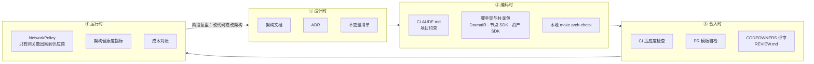
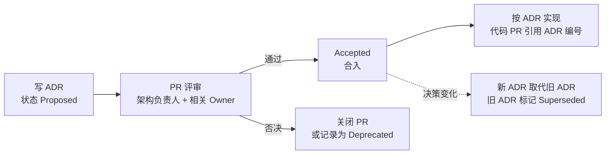

# Dramio：架构治理与落地保障

> 版本：v0.1 · 日期：2026-09-30 · 配套文档：[架构设计方案](architecture.md)、[ADR 目录](adr/README.md)
>
> 核心原则：**不跑偏 ≠ 不变化。** 架构一定会演进，但每一次偏离都必须是**显式的、有记录的、可追溯的**决策，而不是在需求压力下悄悄发生的。

---

## 目录

1. [项目为什么会跑偏](#1-项目为什么会跑偏)
2. [治理框架：四道防线](#2-治理框架四道防线)
3. [架构不变量](#3-架构不变量)
4. [架构决策记录（ADR）](#4-架构决策记录adr)
5. [自动化检查（适应度函数）](#5-自动化检查适应度函数)
6. [豁免与技术债](#6-豁免与技术债)
7. [分阶段落地](#7-分阶段落地)
8. [架构演进的触发条件](#8-架构演进的触发条件)
9. [角色与节奏](#9-角色与节奏)
10. [AI 辅助开发的约束](#10-ai-辅助开发的约束)
11. [架构健康度指标](#11-架构健康度指标)
12. [跑偏信号与纠偏动作](#12-跑偏信号与纠偏动作)
13. [落地清单](#13-落地清单)

---

## 1. 项目为什么会跑偏

| 原因 | 典型表现 | 对应机制 |
|---|---|---|
| 交付压力下走捷径 | “先直连一下供应商，回头再改”；回头永远不会来 | 不变量 + CI 自动拦截（§3、§5）；确需例外走带到期日的豁免（§6） |
| 决策只存在于脑子和聊天记录 | 半年后没人知道为什么这样设计，新人按自己的理解重写 | ADR（§4） |
| 文档与代码脱节 | 架构文档停留在 v0.1，代码早已面目全非 | 文档与代码同 PR 更新；阶段复盘（§9） |
| 一次性验证代码变成生产代码 | P0 脚本被一路改成“核心模块” | `spikes/` 隔离，禁止被产品代码依赖（§5、§7） |
| 分层逐个建设 | 剧本模块打磨半年，其他层还不存在，最后接不上 | 行走骨架：先打通最薄的全链路（§7.1） |
| 过早或过晚演进 | 太早上微服务拖慢进度；或该拆的时候没人敢拆 | 预先约定的演进触发条件（§8） |
| 新模型、新工具的诱惑 | 每个新模型都“接一下试试”，接入方式五花八门 | 模型网关 + 评测回归（ADR-0004） |
| AI 编码助手不了解上下文 | 生成的代码能跑，但绕开了网关、自造数据结构 | CLAUDE.md + REVIEW.md + 检查结果带不变量编号（§10） |
| 没人对架构负责 | 每个人都在做局部最优 | 架构负责人 + CODEOWNERS（§9） |

---

## 2. 治理框架：四道防线



设计要点：

- **能自动判定的，一律自动化**。靠人记住的规则一定会被忘记；CI 拦截的规则不会。
- **让正确的做法成为最省事的做法**。提供 DramaIR 生成类型、节点 SDK、资产 SDK、网关客户端，开发者照着用就不会跑偏。
- **越往后的防线越贵**。能在设计时发现的问题不要留到评审；能在评审发现的不要留到线上。

---

## 3. 架构不变量

不变量是**任何阶段都不允许违反**的规则。阶段性的简化是允许的（见 §7），但简化不能以违反不变量为代价。确实需要例外时，走 §6 的豁免流程。

| 编号 | 不变量 | 为什么 | 如何检查 | 生效阶段 |
|---|---|---|---|---|
| INV-01 | **模型调用只经模型网关**：网关之外不引用供应商 SDK、不硬编码模型 ID | 模型迭代快，换模型只改网关；统一计量与合规路由 | 自动：`archcheck` 的 `vendor-sdk`、`model-id` 规则；运行时：NetworkPolicy 出网白名单 | P1 起 |
| INV-02 | **DramaIR 是剧本数据的唯一事实来源**：Schema 只在 `packages/drama-ir` 定义，类型只生成不手写，破坏性变更需升级主版本并附迁移 | 多份剧本结构必然不一致，增量重算无从谈起 | 自动：生成类型一致性、Schema 兼容性检查（P1 上线）；评审 | P1 起 |
| INV-03 | **分层与边界**：apps / services / workers 之间不直接 import，只经 API、事件或 Temporal 交互；共享代码放 `packages/`；单体内模块不跨模块访问数据表 | 保证将来能独立部署、独立演进 | 自动：`archcheck` 的 `dependency` 规则；模块内部边界用 dependency-cruiser / import-linter（P1 上线） | P1 起 |
| INV-04 | **长流程只走 Temporal**：API 请求中不做同步生成；不用 cron 或自建队列编排生产流程；Workflow 代码确定性，变更需版本化 | 流程持续数天，必须可恢复、可观测 | 自动：Workflow 回放测试（P2 上线）；评审 | P1 起 |
| INV-05 | **生成步骤幂等**：每次生成调用都带 `node_key` 作为幂等键并接入缓存 | 重试安全；修改只重算受影响部分 | 自动：网关拒绝缺少幂等键的请求；节点 SDK 强制声明输入 | P1 起 |
| INV-06 | **媒体产物内容寻址**：只写入 CAS，业务数据只引用 `sha256` | 去重、缓存、溯源 | 评审；资产 SDK 是唯一写入入口 | P1 起 |
| INV-07 | **每次模型调用都计量入账** | 成本可控的前提 | 运行时：网关调用量与成本账本、供应商账单每日对账 | P1 起 |
| INV-08 | **合规步骤不可跳过**：AIGC 标识、内容审核、发布前质检在生产环境不可关闭 | 违规的代价是下架和处罚 | 自动：配置 Schema 禁止在 prod 关闭；发布守卫测试 | P1 起 |
| INV-09 | **租户隔离**：业务表都有 `tenant_id` 并启用行级安全 | 从单租户走向 SaaS 时不需要重写数据层 | 自动：数据库迁移检查（P1 上线） | P1 起 |
| INV-10 | **Prompt 与模型变更可回归**：Prompt 模板在 `packages/prompts` 版本化；新模型、新 Prompt 上线前通过评测集回归 | 生成质量不会在无人察觉时退化 | 自动：评测回归进入 CI（P2 上线） | P2 起 |
| INV-11 | **结构与文档同步**：顶层目录与架构文档一致；ADR 格式正确并登记索引；架构相关改动在同一 PR 更新文档 | 文档是代码的地图，地图错了就会走错路 | 自动：`archcheck` 的 `layout`、`adr` 规则；评审 | 现在起 |

> P0 阶段的验证代码放在 `spikes/`，不受 INV-01 ~ INV-10 约束（可以直连供应商、硬编码模型），但**任何产品代码都不允许依赖 `spikes/`**，这一点从现在起就由 CI 强制执行。

---

## 4. 架构决策记录（ADR）

### 4.1 什么时候必须写 ADR

满足任一条件：

1. 新增、修改或豁免一条不变量；
2. 引入新的基础设施、存储、中间件、编程语言或外部供应商类别；
3. 改变 zone 或模块边界（拆分服务、合并模块、新增顶层目录）；
4. DramaIR 主版本升级；
5. 触发 §8 中的演进条件；
6. 修改 `tools/archcheck/rules.toml`；
7. 任何“半年后别人会问为什么这样做”的决定。

不需要 ADR 的：具体实现细节、库的小版本升级、模块内部重构。

### 4.2 流程



- 模板：[docs/adr/template.md](adr/template.md)；索引：[docs/adr/README.md](adr/README.md)。
- 每个 ADR 都要写“复审条件”：在什么可观测的情况下应该重新评估这个决策。
- Proposed 状态超过两周未决的 ADR，在架构例会上优先处理（决策拖延本身就是跑偏的来源）。
- 当前的 ADR-0001 ~ 0010 记录了架构方案 v0.1 中的核心决策，状态为 Proposed，**需要在 P0 结束时评审并转为 Accepted 或修订**。

---

## 5. 自动化检查（适应度函数）

适应度函数（fitness function）是“用代码表达的架构约束”。它把不变量从文档里的一句话，变成 CI 上的一个红叉。

### 5.1 已上线：`tools/archcheck`

```bash
make arch-check      # 运行规则自测 + 检查整个仓库
```

| 规则 | 检查内容 | 对应不变量 |
|---|---|---|
| `layout` | 顶层目录必须在架构约定的列表中 | INV-11 |
| `adr` | ADR 文件名、标题编号、状态合法、Superseded 必须注明取代者、必须登记在索引中 | INV-11 |
| `dependency` | zone 之间的依赖方向（相对路径 import 和 `@dramio/*`、`dramio_*` 包名都会解析）；`spikes/` 不可被依赖 | INV-03 |
| `vendor-sdk` | 模型供应商 SDK 只能在 `services/model-gateway` 中 import | INV-01 |
| `model-id` | 模型 ID 不能硬编码在网关和评测之外 | INV-01 |

- 规则配置：`tools/archcheck/rules.toml`（修改规则 = 修改架构约束，需要 ADR 和架构负责人批准）。
- 报错格式：`[INV-01 vendor-sdk] workers/llm/writer.py:3: 直接引用模型供应商 SDK 'anthropic'；…`，带不变量编号，人和 AI 助手都能据此定位规则。
- 只依赖 Python 标准库，CI 中通过 `.github/workflows/architecture.yml` 在每个 PR 上运行。

### 5.2 随阶段补充的检查

| 检查 | 工具（建议） | 对应不变量 | 上线阶段 |
|---|---|---|---|
| DramaIR 生成类型与 Schema 一致（重新生成后无差异） | 代码生成脚本 + `git diff --exit-code` | INV-02 | P1 |
| DramaIR Schema 向后兼容（与 main 分支比较，破坏性变更必须升主版本） | JSON Schema 差异比较脚本 | INV-02 | P1 |
| 单体内模块边界（TS） | dependency-cruiser | INV-03 | P1 |
| Worker 内部分层（Python） | import-linter | INV-03 | P1 |
| 数据库迁移：业务表必须有 `tenant_id` 并启用 RLS | 迁移文件检查脚本 | INV-09 | P1 |
| 生产配置不允许关闭合规步骤 | 配置 Schema 校验 | INV-08 | P1 |
| 模型网关适配器契约测试（录制的请求/响应） | 共享测试套件 | INV-01 | P1 |
| Temporal Workflow 回放测试（防止非确定性变更） | Temporal SDK Replayer | INV-04 | P2 |
| 评测集回归（一致性、瑕疵率、成本、延迟） | `evals/` + CI 定时任务 | INV-10 | P2 |
| 单位成片成本预算（评测样片的成本不超过基线 + 阈值） | 评测任务输出成本报告 | INV-07 | P2 |
| API 性能预算（p95 延迟） | 压测脚本 | — | P2 |

每上线一项检查，就在本表中标注，并在 `rules.toml` 或 CI 配置中落地。

---

## 6. 豁免与技术债

现实中总会有“这次确实来不及”的情况。关键是：**例外必须登记、必须有人负责、必须会到期。**

### 6.1 豁免（针对自动检查）

在 `tools/archcheck/exceptions.toml` 中登记：

```toml
[[exception]]
rule = "vendor-sdk"
path = "workers/video/legacy_client.py"
reason = "P1 期间视频供应商适配器尚未迁入模型网关"
owner = "@someone"
expires = 2026-12-31
link = "docs/tech-debt.md#td-001"
```

- `owner`、`expires`、`reason` 缺一不可，否则 CI 失败；
- **到期后 CI 自动失败**，只能偿还技术债，或经架构负责人批准后续期（续期要写明原因）；
- 未被使用的豁免会给出警告，提示删除；
- `exceptions.toml` 受 CODEOWNERS 保护，新增或续期必须由架构负责人批准。

### 6.2 技术债登记

所有豁免和阶段性简化都登记在 [docs/tech-debt.md](tech-debt.md)，写明偿还触发条件或截止阶段。

- 每个迭代预留约 15%–20% 的研发容量用于偿还技术债和架构改进；
- 架构例会（§9）过一遍即将到期的豁免和新增的技术债；
- 豁免数量持续增长是明确的跑偏信号（§12）。

---

## 7. 分阶段落地

### 7.1 行走骨架（Walking Skeleton）

**不要一层一层地建，要先打通最细的全链路，再逐步加厚。**

P1 的第一个里程碑不是“剧本模块完成”，而是**一条最薄的链路穿过所有层**：


骨架打通后，每个后续功能都是在某一层“加厚”，而不是新建一条旁路。这样架构的每一层从第一天起就真实存在、真实被使用，不会出现“某一层直到最后才发现接不上”。

### 7.2 各阶段的架构组件

图例：✅ 完整实现 · 🟡 允许的简化（需登记技术债） · — 暂不引入

| 组件 | P0 验证 | P1 MVP | P2 规模化 | P3 平台化 |
|---|---|---|---|---|
| DramaIR | 🟡 草案 Schema | ✅ v1 + 生成类型 | ✅ + 兼容性检查 | ✅ |
| Temporal 编排 | — 脚本串联 | ✅ | ✅ + 回放测试 | ✅ |
| 模型网关 | — 在 spikes 中直连 | 🟡 静态路由，每能力 1–2 家 | ✅ 动态路由、熔断、A/B | ✅ |
| 内容寻址存储 | 🟡 本地目录 | ✅ | ✅ + 生命周期 | ✅ + 跨区域复制 |
| node_key 缓存与增量重算 | — | 🟡 计算并复用缓存 | ✅ 失效传播 + 锁定 | ✅ |
| 自动质检 | — 人工看 | 🟡 技术规格 + 人脸相似度 | ✅ 全量 + 自动择优 | ✅ |
| 事件总线 | — | 🟡 PostgreSQL outbox | 按 §8 触发引入 Kafka | ✅ |
| 分析库 | — | 🟡 PostgreSQL | 按 §8 触发引入 ClickHouse | ✅ |
| 向量库 | — | 🟡 pgvector | 🟡 pgvector | 按 §8 触发迁移 |
| 自建 GPU | — | — 全部第三方 API | ✅ 部分能力 | ✅ |
| 多租户 | — | 🟡 单租户，但表带 `tenant_id` + RLS | ✅ | ✅ SaaS |
| 合规（AIGC 标识、审核） | — | ✅ **不允许简化** | ✅ | ✅ + 出海 |
| 分发与数据闭环 | — | 🟡 导出交付包 | 🟡 部分平台直发 | ✅ |

注意多租户这一行：P1 可以只有一个租户，但**表结构和行级安全从第一天起就按多租户设计**。这类“以后再加代价极高”的约束，不能作为简化项。

### 7.3 各阶段的退出标准

阶段结束时必须同时满足**业务标准**和**架构标准**，才能进入下一阶段。

| 阶段 | 业务标准 | 架构标准 |
|---|---|---|
| P0 验证 | 全自动产出 1 集 1 分钟成片；各环节候选模型评测报告；单集成本与人工工时基线 | ADR-0001 ~ 0010 评审完毕（Accepted 或修订）；DramaIR 草案 Schema；spikes 的结论整理进文档；为 P2 设定量化目标（成本、QC 通过率） |
| P1 MVP | 内部团队用平台完成 1 部完整剧 | 行走骨架贯通；`archcheck` 零违规、零过期豁免；§5.2 中 P1 的检查全部上线；架构文档更新为 v1.0 基线；`spikes/` 清空 |
| P2 规模化 | 同时在产多部剧；单位成片成本与 QC 自动通过率达到 P0 设定的目标 | §5.2 中 P2 的检查上线；增量重算与锁定上线；自建 GPU 接管至少 2 项能力；技术债登记簿中没有超过一个阶段的遗留项 |
| P3 平台化 | 外部租户上线；分发与数据闭环运转；出海区域上线 | 开放 API 与节点插件机制；多区域部署；全部不变量都有自动检查或运行时监控 |

---

## 8. 架构演进的触发条件

预先约定“什么时候改架构”，既防止过早优化，也防止该改的时候没人敢改。满足条件后，写 ADR 并执行。

| 当前做法 | 演进为 | 触发条件（满足任一） |
|---|---|---|
| 模块化单体 | 拆出独立服务 | 某模块需要独立扩缩容；多个小组在同一服务上发布频繁冲突；某模块的可用性要求明显高于其他模块 |
| PostgreSQL outbox | Kafka | 事件消费者达到 3 个以上；需要事件回放；outbox 延迟影响用户体验 |
| PostgreSQL 做分析 | ClickHouse | 分析查询影响主库性能；开始接入平台播放数据 |
| pgvector | Milvus | 向量规模或检索延迟超过 P1 压测后设定的阈值 |
| 第三方模型 API | 自建模型 | 该能力的月支出超过同等自建成本，且开源模型在评测集上达到质量线 |
| 静态路由 | 动态路由 | 同一能力接入 3 家以上供应商，或供应商故障已影响交付 |
| 单区域 | 多区域 | 出海业务立项 |

---

## 9. 角色与节奏

### 9.1 角色

| 角色 | 职责 |
|---|---|
| 架构负责人（1 人） | 对不变量、ADR 决议、豁免审批负最终责任；主持架构例会。初期可由技术负责人兼任 |
| 模块 Owner | 在 CODEOWNERS 中登记，负责所辖路径的评审与技术债 |
| 所有开发者（含 AI 助手） | 遵守 CLAUDE.md；提交前运行 `make arch-check`；按 PR 模板自检 |

### 9.2 节奏

| 频率 | 活动 | 产出 |
|---|---|---|
| 每个 PR | CI 检查 + PR 模板自检 + CODEOWNERS 评审 | — |
| 每周 | 架构负责人查看健康度指标（§11） | 异常跟进 |
| 每两周 | 架构例会（30 分钟）：待决 ADR、即将到期的豁免、跑偏信号 | ADR 决议、技术债排期 |
| 每个里程碑末 | 架构复盘：逐章对照架构文档与实际实现 | 每处差异的结论只有两种：**改代码回归架构**，或**写 ADR 修改架构**；更新文档版本号 |
| 每季度 | 模型与供应商评测刷新 | 网关路由配置更新，必要时写 ADR |

---

## 10. AI 辅助开发的约束

这个项目会大量使用 AI 编码助手。AI 写代码很快，但它只知道你告诉它的上下文，所以**需要把架构约束写成它每次都会读到的形式**：

| 机制 | 作用 |
|---|---|
| [CLAUDE.md](../CLAUDE.md) | 每次会话自动加载：项目地图、不变量、开工前必读、禁止事项 |
| [REVIEW.md](../REVIEW.md) | 自动代码评审的规则：违反不变量列为阻断项 |
| `archcheck` 报错带不变量编号和文档位置 | AI 能根据报错自行定位规则并修正，而不是瞎猜 |
| 先计划后编码 | 较大的功能先让 AI 输出实现计划，写明涉及的架构章节和 ADR，人确认后再写代码 |
| 规则文件受保护 | `rules.toml`、`exceptions.toml` 受 CODEOWNERS 保护；AI 不能用“加豁免”“改规则”的方式让检查通过 |
| 同样的门禁 | AI 生成的 PR 与人写的 PR 走完全相同的 CI 和评审流程 |

给 AI 布置任务时，最好直接引用架构章节和 ADR，例如：“按 architecture.md §5.5 和 ADR-0006 实现配音节点”。

---

## 11. 架构健康度指标

| 指标 | 目标 | 数据来源 |
|---|---|---|
| main 分支的不变量违规数 | 0 | CI |
| 有效豁免数 / 已过期豁免数 | 趋势下降 / 0 | `exceptions.toml` |
| Proposed 状态超过 2 周的 ADR 数 | 0 | ADR 索引 |
| 经网关的模型调用占比 | 100% | 网关调用量 vs 供应商账单 |
| 成本账本对账差异 | < 1% | 成本账本 vs 供应商账单 |
| node_key 缓存命中率 | 持续观察，骤降需排查 | 网关、编排日志 |
| 单位成片成本（元 / 成片分钟） | 按阶段目标下降 | 成本账本 |
| QC 自动通过率 / 人工返工率 | 自动通过率上升，返工率下降 | 审核记录 |
| Workflow 失败率、卡住的 Workflow 数 | 持续下降 | Temporal |
| 技术债登记数与平均存活时间 | 不持续增长 | tech-debt.md |

这些指标放在同一个看板上，每周看一次。它们既是架构健康度，也直接对应业务目标（成本、质量、产能）。

---

## 12. 跑偏信号与纠偏动作

| 信号 | 说明 | 纠偏动作 |
|---|---|---|
| “先临时这样，回头再改” | 最常见的跑偏起点 | 要么现在按架构做，要么登记豁免和到期日，没有第三种 |
| 同一个概念出现第二套数据结构 | 例如分镜服务自定义了一个 shot 格式 | 评审阻断，统一回 DramaIR；DramaIR 不够用就扩展 Schema |
| API 请求越来越慢 | 可能有人在请求里同步跑生成 | 按 INV-04 迁到 Workflow |
| 豁免数量持续增长 | 架构和现实脱节，或偿还没有排期 | 架构例会优先处理：偿还，或承认现实、写 ADR 调整架构 |
| ADR 长期停在 Proposed | 决策瓶颈 | 架构负责人限期决议 |
| 架构文档很久没更新但代码变化很大 | 地图已经失效 | 提前进行一次架构复盘 |
| 单位成片成本上升、缓存命中率下降 | 可能有节点绕过了 node_key 缓存 | 排查新增节点类型的输入声明 |
| 某个模块谁都不敢改 | 边界已经腐化 | 列为技术债，安排专项重构 |

---

## 13. 落地清单

### 13.1 已完成（本仓库中）

- [x] 架构设计方案：`docs/architecture.md`
- [x] 架构治理方案（本文档）
- [x] ADR 模板、索引和 10 条初始 ADR：`docs/adr/`
- [x] 自动检查工具及其单元测试：`tools/archcheck/`
- [x] CI 工作流：`.github/workflows/architecture.yml`
- [x] AI 助手约束：`CLAUDE.md`、`REVIEW.md`
- [x] PR 模板与 CODEOWNERS：`.github/`
- [x] 技术债登记簿：`docs/tech-debt.md`

### 13.2 需要在 GitHub 上手动设置

- [ ] 创建 `main` 分支并设为默认分支；
- [ ] 为 `main` 开启分支保护：禁止直接推送、必须通过 PR 合入、必须通过 `arch-check` 状态检查、必须有 Code Owner 评审；
- [ ] 团队成员加入后，把 `.github/CODEOWNERS` 中的负责人换成具体成员或小组。

### 13.3 P0 期间完成

- [ ] 评审 ADR-0001 ~ 0010，转为 Accepted 或修订；
- [ ] 指定架构负责人，约定架构例会时间；
- [ ] 按 §7.3 的 P0 退出标准完成验证，并据此为 P2 设定量化目标。
