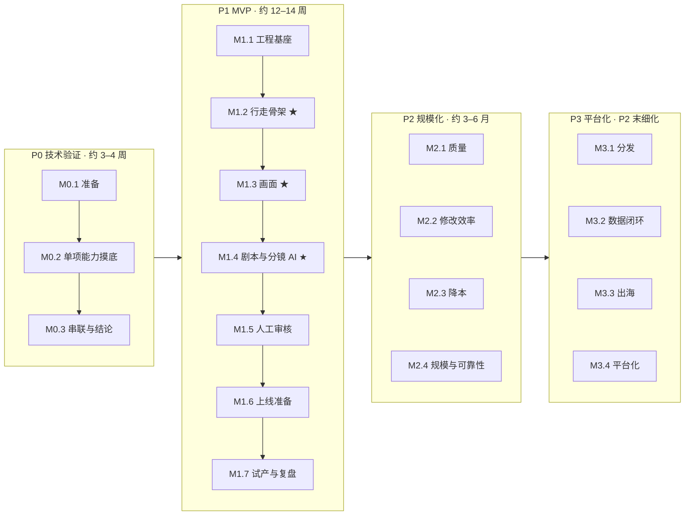

# Dramio：分步实施路线图

> 版本：v0.1 · 日期：2026-09-30 · 配套文档：[架构设计方案](architecture.md)、[架构治理](governance.md)
>
> 目标：把 P0 ~ P3 拆成**小步骤**。每一步只做一件事，几天内完成，结束时有能运行、能演示的结果，然后再开始下一步。

---

## 当前进度

执行中的细节（当前步骤、子任务断点、待决事项、交接日志）见 **[progress.md](progress.md)**；本文件只记录每个步骤的状态。

推进方式：说“继续当前进度”或输入 `/continue`，agent 会按进度推进完当前里程碑后汇报；`/progress` 查看进度，`/decide` 回复待决事项（见 [CLAUDE.md](../CLAUDE.md#工作流命令)）。

状态图例：⬜ 未开始 · 🔄 进行中 · ✅ 完成 · ⏸ 暂停 / 调整

---

## 1. 小步快跑的工作约定

1. **步骤要小**：一个步骤一般 0.5–3 天，最长不超过 1 周；估计超过 1 周就继续拆。
2. **每步可演示**：每个步骤结束时必须有能运行、能看到的结果（命令输出、页面、音频、视频），主干随时可用。
3. **一步一个 PR**：一个步骤对应一个 PR，最多拆成 2–3 个；单个 PR 建议不超过约 400 行改动（生成代码和锁文件不计）。
4. **一次只做一步**：做完、合入、演示，再开始下一步。人手多时最多并行两个互不依赖的步骤。
5. **先打通再加厚**：先用最简单的方式让链路跑通，再逐步替换成完整实现（行走骨架，见 [governance.md §7.1](governance.md#71-行走骨架walking-skeleton)）。
6. **不留长期分支**：没做完的功能用功能开关隐藏，尽快合入主干。
7. **近细远粗**：P0、P1 拆到步骤级；P2 拆到步骤名；P3 只列里程碑，到 P2 复盘时再细化。
8. **按里程碑推进**：每次“继续”推进完当前里程碑（一个步骤一个 PR，CI 通过后自动合并），在里程碑演示点汇报；自主程度由 progress.md 的“自主推进设置”决定。
9. **计划可以改**：每周演示后调整下周计划；调整的内容和原因写进本文档的变更记录。

### 1.1 每个步骤的完成标准（Definition of Done）

- [ ] 验收标准全部满足，演示结果已记录（截图、短视频或命令输出）；
- [ ] `make arch-check` 和测试通过；
- [ ] 相关文档、ADR 已同步更新；
- [ ] 如有临时简化，已登记到 [tech-debt.md](tech-debt.md)；
- [ ] 本文档中该步骤的状态已更新为 ✅。

### 1.2 步骤卡：开工前写清楚

每个步骤开始前，在 PR 描述（或 Issue）中写一张步骤卡。**把步骤卡交给 AI 编码助手，就是一次大小合适的任务。**

```markdown
## P1-08 模型网关 v0
- 目标：一句话说明做完之后多了什么能力
- 做：……
- 不做：……（明确排除，防止范围膨胀）
- 验收：……（可验证的条件）
- 涉及：architecture.md §7；ADR-0004；INV-01、INV-05、INV-07
- 估时：3 天
```

---

## 2. 全局视图



★ 表示该里程碑结束时有一次完整的端到端演示。

估时按 1–2 名开发者、配合 AI 编码助手估算，仅作排期参考，以每周实际进度为准。

---

## 3. P0 技术验证（约 3–4 周，14 步）

**目标**：用尽量少的代码回答四个问题：
1. 角色一致性能否稳定达标？
2. 单集成本和耗时是多少？
3. 口型能否达到可播出水平？
4. 哪个环节返工最多？

**范围**：
- 验证代码全部放在 `spikes/poc/`，P1 结束前删除；它可以直连模型供应商，但任何产品代码都不能依赖它。
- P0 真正要留下的是**结论报告**（`docs/reports/p0/`）和 **DramaIR 草案**（`packages/drama-ir/`），不是代码。

**不做**：Web 界面、数据库、工作流引擎、模型网关。

### M0.1 准备（约 1.5 天）

| 编号 | 步骤 | 交付（可演示） | 验收标准 | 依赖 | 估时 | 状态 |
|---|---|---|---|---|---|---|
| P0-01 | 验证脚手架 | `spikes/poc` Python 项目；从 `.env` 读取密钥；每次运行输出到 `runs/<run_id>/`；每次模型调用的耗时和费用记入 `calls.jsonl` | `python -m poc doctor` 能检查各供应商密钥是否可用 | — | 0.5 天 | ✅ |
| P0-02 | DramaIR v0 与标准样例 | `packages/drama-ir/schema/v0/` 最小 JSON Schema（剧、角色、集、场、镜、台词）；手写 1 集 1 分钟样例（2 个角色、约 12 个镜头、约 15 句台词）；校验命令 | 样例通过校验；团队确认它作为后续所有评测的**固定输入** | — | 1 天 | ✅ |

### M0.2 单项能力摸底（约 2 周）

每一步都用标准样例作为输入，对比 2–3 个候选方案，产出一页结论（`docs/reports/p0/<编号>.md`），内容包括效果样例、单价、耗时、失败率和推荐方案。

| 编号 | 步骤 | 交付（可演示） | 验收标准 | 依赖 | 估时 | 状态 |
|---|---|---|---|---|---|---|
| P0-03 | 剧本生成 | 一句话梗概 → 1 集剧本，结构化输出为 DramaIR v0 | 连续 5 次生成全部通过校验；有人工评分记录 | P0-02 | 1.5 天 | ✅ |
| P0-04 | 分镜拆解 | 剧本 → 镜头列表（景别、运镜、时长、台词挂载） | 镜头数量与时长合理；通过校验 | P0-03 | 1 天 | ✅ |
| P0-05 | 配音 | 样例台词 → 逐句音频；时长统计；ASR 回检字错率 | 对比表；选出默认方案 | P0-02 | 1 天 | ✅ |
| P0-06 | 角色定妆 | 角色描述 → 定妆图、三视图、表情 | 每个角色选定一套可用定妆 | P0-02 | 1 天 | ✅ |
| P0-07 | 关键帧与一致性度量 | 镜头 + 定妆参考 → 首帧；人脸相似度脚本 | 得到 12 个镜头的人脸相似度分布；找到至少一种可用的一致性方案 | P0-04、P0-06 | 2 天 | ⬜ |
| P0-08 | 图生视频 | 关键帧 → 5 秒视频片段 | 对比效果、单价、耗时、失败率 | P0-07 | 1.5 天 | ⬜ |
| P0-09 | 口型同步 | 对白镜头视频 + 音频 → 口型对齐视频 | 可播出性人工评分；确定默认路线（后期口型或原生音画同步） | P0-05、P0-08 | 1 天 | ⬜ |
| P0-10 | 音乐音效 | 按情绪选取或生成 BGM；按标签配音效 | 至少一种可商用的 BGM 来源 | P0-02 | 0.5 天 | ⬜ |
| P0-11 | 剪辑合成 | 生成 OTIO → FFmpeg 渲染：拼接、字幕、混音、AIGC 标识 | 输出 1080×1920 成片；OTIO 能导入专业剪辑软件 | P0-05、P0-08 | 1.5 天 | ⬜ |

P0-05、P0-06、P0-10 只依赖样例，可以和 P0-03、P0-04 交错进行。

### M0.3 串联与结论（约 4 天）

| 编号 | 步骤 | 交付（可演示） | 验收标准 | 依赖 | 估时 | 状态 |
|---|---|---|---|---|---|---|
| P0-12 | 一键串联 | `python -m poc run --logline "…"` 全自动出片；按输入哈希缓存中间结果（验证 node_key 思路） | 从梗概到成片无人工干预；第二次运行命中缓存，几乎零成本 | P0-03 ~ P0-11 | 2 天 | ⬜ |
| P0-13 | 规模抽测 | 连续跑 3 集（或 1 集 30 个以上镜头） | 用数据回答 P0 的四个问题 | P0-12 | 1 天 | ⬜ |
| P0-14 | P0 复盘 | 评测总报告；ADR-0001 ~ 0010 评审；DramaIR v0 修订；设定 P2 的量化目标；补写 P1 需要的 ADR（如模型网关的实现语言） | 满足 [governance.md §7.3](governance.md#73-各阶段的退出标准) 的 P0 退出标准 | P0-13 | 1 天 | ⬜ |

**P0 周计划参考**

| 周 | 步骤 |
|---|---|
| 第 1 周 | P0-01 ~ P0-05 |
| 第 2 周 | P0-06 ~ P0-09 |
| 第 3 周 | P0-10 ~ P0-12 |
| 第 4 周 | P0-13、P0-14（进度顺利可提前结束） |

---

## 4. P1 MVP（约 12–14 周，30 步）

**目标**：做成内部团队可用的生产工具，并用它完成一部完整的剧。

**顺序原则**：
- 先搭**行走骨架**（M1.2），让 Web → API → 工作流 → 网关 → 存储 → 渲染整条链路尽早真实跑通；
- 再把风险最高、价值最大的**画面**加进来（M1.3）；在此之前，剧本直接导入 P0 产出的 DramaIR；
- 然后把剧本和分镜的 AI 搬进平台（M1.4）。

### M1.1 工程基座（约 1.5 周）

| 编号 | 步骤 | 交付（可演示） | 验收标准 | 依赖 | 估时 | 状态 |
|---|---|---|---|---|---|---|
| P1-01 | Monorepo 工具链 | pnpm + turbo（TS）、uv（Python）；统一的 lint、格式化、测试命令接入 CI；`apps/api` 健康检查接口，`apps/web` 首页 | CI 通过；`make check` 一条命令跑完所有检查 | P0-14 | 2 天 | ⬜ |
| P1-02 | 本地开发环境 | docker compose：PostgreSQL、Redis、MinIO、Temporal 开发服务 | `make up` 后所有服务健康 | P1-01 | 1 天 | ⬜ |
| P1-03 | DramaIR v1 包 | Schema v1；生成 zod 与 pydantic 类型；**CI 检查生成类型与 Schema 一致、Schema 向后兼容** | 故意手改生成文件或删除字段时 CI 失败 | P1-01 | 2 天 | ⬜ |
| P1-04 | 数据库与多租户基座 | 迁移框架；租户、项目表；行级安全；**迁移检查** | 缺少 `tenant_id` 或 RLS 的迁移被 CI 拦截 | P1-02 | 1.5 天 | ⬜ |

### M1.2 行走骨架（约 2.5 周）★

| 编号 | 步骤 | 交付（可演示） | 验收标准 | 依赖 | 估时 | 状态 |
|---|---|---|---|---|---|---|
| P1-05 | 项目管理 | Web 创建和查看项目 | 刷新后数据仍在；不同租户互相不可见 | P1-04 | 1.5 天 | ⬜ |
| P1-06 | 剧本导入 | 粘贴 DramaIR JSON → 校验 → 保存修订版本 → Web 显示 集 / 场 / 镜 结构 | 非法 JSON 给出明确错误；每次保存生成新修订 | P1-03、P1-05 | 2 天 | ⬜ |
| P1-07 | 工作流打通 | API 触发 Temporal 单集工作流 → Python 空任务 → 进度通过 SSE 推到 Web | 杀掉 Worker 再重启，工作流能继续跑完 | P1-06 | 2 天 | ⬜ |
| P1-08 | 模型网关 v0 | 独立服务；只支持 `audio.tts` 一种能力、一家供应商；静态路由；幂等键；每次调用写入成本账本 | 同一幂等键重复请求不重复计费；账本与调用一一对应 | P1-07 | 3 天 | ⬜ |
| P1-09 | 资产 SDK 与 CAS | 生成产物写入 MinIO 内容寻址存储；`asset` 表；预签名 URL；Web 可播放台词音频 | 相同内容只存一份 | P1-08 | 2 天 | ⬜ |
| P1-10 | 渲染打通 | 配音 + 占位画面（纯色背景 + 字幕）→ OTIO → FFmpeg → Web 播放预览 | **演示：粘贴剧本，一键得到“配音 + 字幕”的动态分镜版成片** | P1-09 | 2 天 | ⬜ |

### M1.3 画面（约 3 周）★

| 编号 | 步骤 | 交付（可演示） | 验收标准 | 依赖 | 估时 | 状态 |
|---|---|---|---|---|---|---|
| P1-11 | 角色与定妆 | 角色管理；通过网关生成定妆图；人工选定；保存人脸基准向量 | 每个角色有选定的定妆和基准向量 | P1-10 | 3 天 | ⬜ |
| P1-12 | 关键帧节点 | 每镜头生成 N 个候选；node_key 缓存；人脸相似度打分；自动选出最优 | 再次运行命中缓存；低于阈值的候选被淘汰 | P1-11 | 3 天 | ⬜ |
| P1-13 | 音频先行 | 配音完成后回填镜头实际时长 | 镜头时长与对白时长一致 | P1-12 | 1 天 | ⬜ |
| P1-14 | 视频节点 | 通过网关做图生视频，替换占位画面 | 成片中每个镜头都是动态画面 | P1-13 | 2.5 天 | ⬜ |
| P1-15 | 口型节点 | 对白镜头做口型同步 | 对白镜头口型人工抽检通过 | P1-14 | 2 天 | ⬜ |
| P1-16 | 音乐音效与混音 | BGM、音效；对白时自动压低 BGM；响度标准化 | **演示：剧本 → 有画面、有口型、有音乐的完整成片** | P1-15 | 2 天 | ⬜ |

### M1.4 剧本与分镜 AI（约 2 周）★

| 编号 | 步骤 | 交付（可演示） | 验收标准 | 依赖 | 估时 | 状态 |
|---|---|---|---|---|---|---|
| P1-17 | 立项与设定 | 梗概 → 立项卡 → 设定集（结构化输出）；Web 表单编辑 | 输出通过 DramaIR 校验；可人工修改 | P1-16 | 2.5 天 | ⬜ |
| P1-18 | 大纲与分集编剧 | 大纲 Agent、分集编剧 Agent；剧情状态表 v1 | 连续生成 5 集，人物状态前后一致 | P1-17 | 3 天 | ⬜ |
| P1-19 | 审稿 Agent | 节奏、逻辑、合规打分；不达标自动打回，最多 K 轮 | 打回记录可查看；超过 K 轮转人工 | P1-18 | 1.5 天 | ⬜ |
| P1-20 | 分镜 Agent 与 Prompt 编译器 | 场次 → 镜头列表；Prompt 模板放在 `packages/prompts` 并带版本号 | **演示：一句话梗概 → 平台内出片** | P1-19 | 3 天 | ⬜ |

### M1.5 人工审核（约 1.5 周）

| 编号 | 步骤 | 交付（可演示） | 验收标准 | 依赖 | 估时 | 状态 |
|---|---|---|---|---|---|---|
| P1-21 | 审核卡点 | 工作流在卡点挂起等待审核；卡点模板（全自动 / 关键节点）；审核台（通过 / 打回 + 原因） | 工作流挂起一天后审核，仍能继续 | P1-20 | 3 天 | ⬜ |
| P1-22 | 镜头挑选台 | 候选并排对比、替换、单镜头重生成 | 替换后重新渲染只影响该镜头 | P1-21 | 2.5 天 | ⬜ |
| P1-23 | 改台词只重算相关部分 | 修改一句台词后，只重做配音、口型、字幕和本集合成 | 其他镜头全部命中缓存（完整的失效传播留到 P2-06） | P1-22 | 2 天 | ⬜ |

两人开发时，M1.5 可以和 M1.4 并行。

### M1.6 上线准备（约 2 周）

| 编号 | 步骤 | 交付（可演示） | 验收标准 | 依赖 | 估时 | 状态 |
|---|---|---|---|---|---|---|
| P1-24 | 合规 | AIGC 显式与隐式标识；文本和图像内容审核；**生产配置不可关闭合规步骤的检查** | 成片带标识；尝试关闭合规步骤时 CI 失败 | P1-16 | 3 天 | ⬜ |
| P1-25 | 成本看板与预算 | 项目 / 集级成本；超预算自动暂停 | 设置很低的预算时工作流会暂停并通知 | P1-08 | 2 天 | ⬜ |
| P1-26 | 可观测性与 staging 部署 | OpenTelemetry 链路追踪；Grafana 基础看板；Helm 部署到 staging | 能按镜头查看完整调用链 | P1-21 | 3 天 | ⬜ |
| P1-27 | 边界守护 | dependency-cruiser / import-linter；网关适配器契约测试；只允许网关访问供应商的网络策略 | 故意跨模块引用或绕过网关时被拦截 | P1-26 | 2 天 | ⬜ |

P1-24、P1-25 只依赖前面的基础能力，可以提前穿插进行。

### M1.7 试产与复盘（约 2 周）

| 编号 | 步骤 | 交付（可演示） | 验收标准 | 依赖 | 估时 | 状态 |
|---|---|---|---|---|---|---|
| P1-28 | 试产 3 集 | 内部团队按真实流程制作 3 集，记录问题清单 | 问题清单按优先级拆成小步骤进入待办 | P1-27 | 3 天 | ⬜ |
| P1-29 | 完成整部剧 | 修复阻塞问题，完成一部完整的剧 | 满足 P1 业务退出标准 | P1-28 | 按剧集数定 | ⬜ |
| P1-30 | P1 复盘 | 架构文档发布 v1.0 基线；清空 `spikes/`；核对退出标准；细化 P2 步骤 | 满足 [governance.md §7.3](governance.md#73-各阶段的退出标准) 的 P1 退出标准 | P1-29 | 1 天 | ⬜ |

---

## 5. P2 规模化（约 3–6 月，20 步）

**目标**：质量稳定、成本下降、多部剧并行。P2 的步骤在 P1-30 复盘时补全交付物、验收标准和估时。

| 里程碑 | 编号 | 步骤 | 目标 | 状态 |
|---|---|---|---|---|
| M2.1 质量 | P2-01 | VLM 画面评审 | 自动识别画面瑕疵，检查画面是否符合镜头描述 | ⬜ |
|  | P2-02 | 综合评分与自动择优 | 多项得分加权选优；人工替换行为回流调权重 | ⬜ |
|  | P2-03 | 身份保持管线（L2） | 自建图像管线中接入身份保持插件 | ⬜ |
|  | P2-04 | 角色 LoRA 自动训练（L3） | 定妆后自动训练并回测一致性 | ⬜ |
|  | P2-05 | 首尾帧控制（L4） | 关键镜头用首尾帧锁定画面 | ⬜ |
| M2.2 修改效率 | P2-06 | 完整失效传播与锁定 | 修改后自动标记过期节点；锁定节点不受影响；修改前预览影响范围 | ⬜ |
|  | P2-07 | 时间线剪辑器 v1 | 在代理文件上修剪、替换、改字幕 | ⬜ |
|  | P2-08 | 专业剪辑软件导出与回传 | OTIO / FCPXML 导出，精修后回传 | ⬜ |
|  | P2-09 | 剧本协同编辑 | 多人实时编辑剧本 | ⬜ |
| M2.3 降本 | P2-10 | 先草后精 | 草稿档与精品档；预览确认后再精修 | ⬜ |
|  | P2-11 | 静图 + 运镜路线 | 静态镜头用图片加运镜代替视频生成 | ⬜ |
|  | P2-12 | GPU 集群基座 | GPU 节点池、按队列积压自动伸缩、模型权重缓存 | ⬜ |
|  | P2-13 | 自建能力 ① | 按 governance §8 的触发条件选择第一项迁移的能力 | ⬜ |
|  | P2-14 | 自建能力 ② | 第二项迁移的能力 | ⬜ |
|  | P2-15 | 网关动态路由 | 按成功率、成本、延迟路由；熔断与 A/B 实验 | ⬜ |
| M2.4 规模与可靠性 | P2-16 | 队列隔离与配额 | 交互 / 批量队列分离；项目与租户配额 | ⬜ |
|  | P2-17 | 工作流回放测试 | 防止修改工作流时引入非确定性 | ⬜ |
|  | P2-18 | 评测回归与成本预算进 CI | 新模型、新 Prompt 上线前自动回归；样片成本超预算时失败 | ⬜ |
|  | P2-19 | 多部剧并行压测 | 验证目标产能下的稳定性与接口性能 | ⬜ |
|  | P2-20 | P2 复盘 | 核对退出标准；把 P3 拆成步骤 | ⬜ |

---

## 6. P3 平台化（P2 复盘时拆成步骤）

| 里程碑 | 候选步骤（按顺序） |
|---|---|
| M3.1 分发 | 标准交付包 → 第一个平台直发 → 封面与标题生成及 A/B → 投流素材自动混剪 |
| M3.2 数据闭环 | 平台数据采集 → 指标看板 → 剧本特征归因 → 反哺选题与剧本知识库 |
| M3.3 出海 | 翻译与配音 → 多语言口型与字幕 → 海外区域部署 |
| M3.4 平台化 | 多租户自助开通与计费 → 开放 API → 节点插件 → 私有化部署 |

---

## 7. 架构检查的上线时间表

自动检查随步骤逐项上线（详见 [governance.md §5](governance.md#5-自动化检查适应度函数)）：

| 检查 | 不变量 | 上线步骤 |
|---|---|---|
| 目录结构、ADR、依赖方向、供应商 SDK 隔离、模型 ID 硬编码 | INV-01、03、11 | ✅ 已上线 |
| DramaIR 生成类型一致、Schema 向后兼容 | INV-02 | P1-03 |
| 迁移检查（`tenant_id` + RLS） | INV-09 | P1-04 |
| 网关幂等键、成本入账 | INV-05、07 | P1-08 |
| 资产 SDK 作为唯一写入口 | INV-06 | P1-09 |
| 生产配置不可关闭合规步骤 | INV-08 | P1-24 |
| 模块边界、网关契约测试、网络策略 | INV-01、03 | P1-27 |
| 工作流回放测试 | INV-04 | P2-17 |
| 评测回归、成本预算 | INV-07、10 | P2-18 |
| 接口性能预算 | — | P2-19 |

---

## 8. 变更记录

| 日期 | 变更 | 原因 |
|---|---|---|
| 2026-09-30 | 初稿：P0、P1 拆到步骤级，P2 拆到步骤名，P3 列出里程碑 | — |
